# La vostra prima avventura in Bitcoin

In questo corso, spiegheremo le basi di Bitcoin in 25 capitoli, affinché possiate comprendere questa tecnologia in modo semplice ed efficace. Il corso esplora le basi del settore nel suo complesso, compresi argomenti come il mining, i wallet, le piattaforme di acquisto/vendita e altro ancora. Altra documentazione didattica sarà disponibile durante il percorso e vi invitiamo a consultare i "21 poster" nella sezione risorse dopo aver terminato il corso.

Non sono necessarie conoscenze specifiche per iniziare. In effetti, i contenuti che seguono sono accessibili a studenti di tutti i livelli e dovrebbe richiedere circa 15 ore per essere completato.

+++

# Introduzione

<partId>3cd2ac82-026c-53e1-874a-baf5842adc6d</partId>

## Un salto nel buio

<chapterId>27e3fb60-4b50-556b-9e70-c4f5475c121d</chapterId>

### Benvenuti in un paradigma monetario e tecnologico tutto nuovo

Bitcoin è una rivoluzione tecnologica e monetaria, capace di farci mettere in discussione il nostro rapporto con il denaro e la società. Infatti, Bitcoin (indicato come BTC) è una moneta **neutrale** e **decentralizzata**, cioè non controllata da alcuna entità o istituzione. È un'innovazione che va oltre la semplice "moneta di internet": è sia un protocollo informatico (Bitcoin) che un'unità monetaria (bitcoin).

Il protocollo utilizza tecnologie sottostanti come la crittografia, la comunicazione di rete e la famosa "blockchain", mentre l'unità bitcoin funge da valuta necessaria per il corretto funzionamento di questo protocollo. Nella vita di tutti i giorni, i salvadoregni e i bitcoiner di tutto il mondo utilizzano la valuta bitcoin per acquistare e vendere beni e servizi, affidandosi a questa tecnologia per migliorare la propria vita.

### Un programma di studi completo ma accessibile

In questo corso discuteremo alcuni aspetti monetari di Bitcoin, tra cui come acquistare e vendere bitcoin, conservarli in modo sicuro nei wallet digitali e utilizzarli per le transazioni. Esamineremo anche il ruolo dei miner, essenziali per la creazione di nuovi bitcoin e per la sicurezza della rete Bitcoin. Infine, esploreremo il futuro di Bitcoin e come la tecnologia Lightning Network possa migliorare le transazioni di Bitcoin.

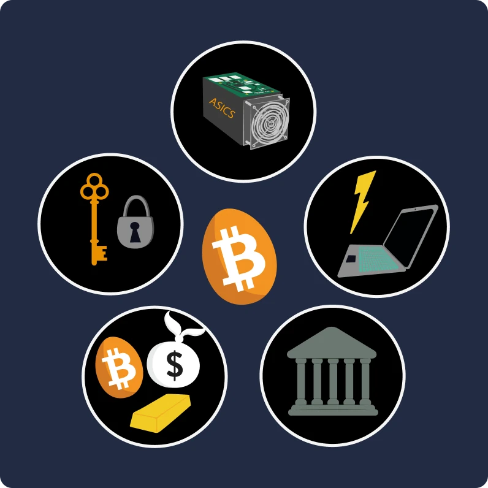

È essenziale capire che Bitcoin è un nuovo sistema monetario che cambia completamente il nostro rapporto con il denaro, quindi imparare a usarlo è una competenza necessaria per chiunque voglia avere il controllo dei propri fondi.

**Sezione 1 - Denaro**

- Capitolo 1 - Che cos'è il denaro?
- Capitolo 2 - La moneta Fiat
- Capitolo 3 - Iperinflazione
- Capitolo 4 - La politica monetaria di Bitcoin

**Sezione 2 - Wallet Bitcoin**

- Capitolo 5 - Come funzionano i wallet Bitcoin?
- Capitolo 6 - Scelta della sicurezza
- Capitolo 7 - Impostazine del tuo wallet
- Capitolo 8 - Salvaguardia nel tempo

**Sezione 3 - Caratteristiche tecniche di Bitcoin**

- Capitolo 9 - Che cos'è una transazione?
- Capitolo 10 - Nodi Bitcoin
- Capitolo 11 - Miner
- Capitolo 12 - Miner ed ecologia

**Sezione 4 - Risparmiare in Bitcoin**

- Capitolo 13 - Prezzo di Bitcoin
- Capitolo 14 - Come si acquista Bitcoin?
- Capitolo 15 - Lavorare in cambio di Bitcoin (non mi piace: in alternativa preferisco «Guadagnare in Bitcoin»)
- Capitolo 16 - Iper-bitcoinizzazione

**Sezione 5 - Lightning Network**

- Capitolo 17 - Introduzione a Lightning Network
- Capitolo 18 - Casi d'uso per Lightning Network

Prima di introdurre la definizione di denaro e la sua funzione nella società (Capitolo 1), dovremmo partire dalla genesi di Bitcoin. Lanciato nel 2009, Bitcoin è una tecnologia relativamente nuova e diversa da qualsiasi altra. È quindi normale che non si riesca a capire tutto e subito. Proprio come quando si impara a usare Internet o a guidare un'automobile, non è necessario conoscere subito tutti i dettagli tecnici: si può iniziare imparando a ricevere, inviare e mettere al sicuro i propri fondi, e poi fare piccoli passi per approfondire l'argomento'.

In fondo, siamo solo agli inizi della sua adozione, avendo appena superato la fase di avviamento: siete in tempo per acquisire tutte le conoscenze che desiderate su questa importante innovazione.

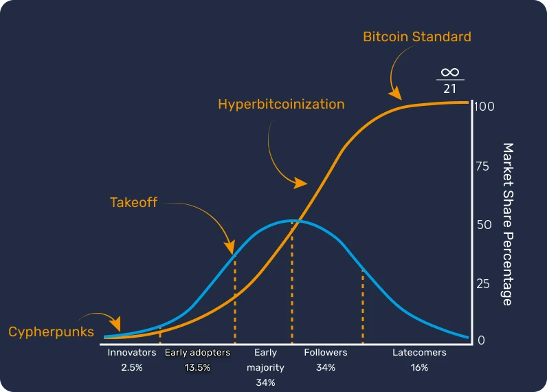

L'importante è capire questa nuova tecnologia in modo generale, quindi vi auguriamo di godervi questo corso e di continuare a fare progressi in questo nuovo paradigma monetario globale.

## La preistoria di Bitcoin (a me non piace, lo tradurrei con «Come si è giunti a Bitcoin»)

<chapterId>9a94b627-5b69-5d81-9125-f1fa9b0aa6ad</chapterId>

Prima che il termine "Bitcoin" diventasse sinonimo di valuta digitale e trasformazione finanziaria, le basi per la sua creazione sono state gettate da una serie di idee, innovazioni e movimenti sociali. Tra questi, il movimento cypherpunk spicca come elemento chiave all'inizio della storia di Bitcoin.

### Cypherpunks: visionari del mondo digitale


Nel cuore dell'evoluzione tecnologica degli anni '80 e '90, un gruppo di persone iniziò a interrogarsi profondamente sul ruolo della privacy e della libertà nell'era digitale. Questi individui, che in seguito sarebbero stati conosciuti come "cypherpunks", credevano fermamente che la crittografia potesse servire come strumento per proteggere i diritti individuali dalle interferenze dei governi e delle grandi aziende.

Figure iconiche come Julian Assange, Wei Dai, Tim May e David Chaum hanno assunto un ruolo fondamentale nel plasmare la filosofia e la visione del movimento. Questi capostipiti hanno condiviso le loro idee in una mailing list influente, dove partecipanti di tutto il mondo si sono impegnati nel dibattito a proposito dei modi migliori di sfruttare la tecnologia per una maggiore libertà individuale.

### I tre testi fondamentali dei Cypherpunk

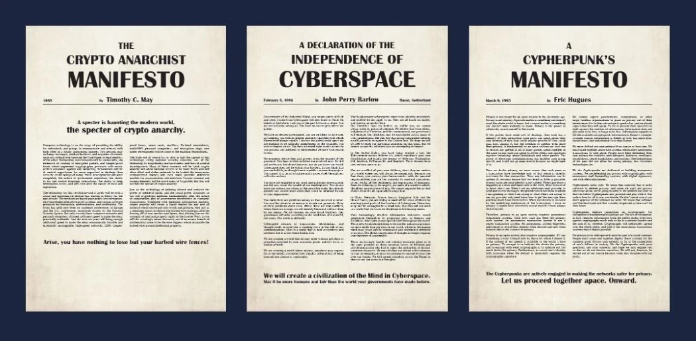

Il movimento cypherpunk, profondamente radicato nell'attivismo digitale e nella crittografia, ha attinto a diversi testi fondamentali per articolare i suoi principi e la sua visione del futuro. Tra questi scritti, tre spiccano in particolare:

- Il "Manifesto Cypherpunk":

scritto da Eric Hughes nel 1993, "The Chypherpunk Manifesto" afferma che la privacy è un diritto fondamentale. L'autore sostiene che la capacità di comunicare liberamente e in modo riservato è essenziale per una società libera. Il manifesto afferma che: "Non possiamo aspettarci che i governi, le aziende o altre grandi organizzazioni senza volto ci garantiscano la privacy [...]. Dobbiamo difendere la nostra privacy se vogliamo averne una".

- Il "Manifesto cripto-anarchico":

scritto da Timothy C. May nel 1992, questo documento spiega come l'uso della crittografia può portare a un'era di anarchia crittografica in cui i governi dovrebbero trovarsi impotenti a interferire negli affari privati dei cittadini. May immagina un futuro in cui le persone si scambiano informazioni e denaro in modo anonimo senza la mediazione di terze parti.

- La "Dichiarazione di indipendenza del cyberspazio":

anche se non esclusivamente cypherpunk, questo testo riflette i sentimenti di molti partecipanti al movimento. Scritto nel 1996 da John Perry Barlow, è una risposta alla crescente regolamentazione di Internet da parte dei governi. Il testo afferma che il cyberspazio è un regno distinto dalla sfera fisica e non dovrebbe essere soggetto alle stesse leggi. Come si legge nella dichiarazione, "non abbiamo un governo eletto, né è probabile che ne avremo uno".

### I predecessori di Bitcoin

Prima della nascita di Bitcoin, ci sono stati diversi tentativi di creare una valuta digitale. Negli anni '80, ad esempio, David Chaum introdusse il concetto di "moneta elettronica anonima" con il suo progetto "DigiCash". Purtroppo, a causa di varie limitazioni, DigiCash non ha mai avuto successo.

Un altro importante precursore è "B-money" di Wei Dai. Sebbene non sia mai stata implementata, avanzava l'idea di una moneta digitale anonima in cui il rilevamento delle frodi fosse effettuato da una comunità di validatori piuttosto che da un'autorità centrale.

La figura sotto illustra chiaramente lo sviluppo del movimento attraverso le sue numerose innovazioni tecnologiche.


È in questo ambiente fertile che il misterioso Satoshi Nakamoto pubblicò il whitepaper di Bitcoin nel 2008. Nel documento combina diverse idee del movimento cypherpunk, come la proof of work e i timestamp crittografici, per creare una valuta digitale decentralizzata e resistente alla censura.

Tuttavia, Bitcoin è più di questo: rappresenta la realizzazione degli ideali cypherpunk. Al di là della sua tecnologia, simboleggia una rivoluzione contro i sistemi finanziari tradizionali e offre un'alternativa basata su trasparenza, decentralizzazione e sovranità individuale.

### Conclusione

Le origini di Bitcoin sono profondamente radicate nel movimento cypherpunk e nella ricerca comune di una maggiore libertà nell'era digitale. Combinando i principi della crittografia, della decentralizzazione e dell'integrità, Bitcoin è diventato molto più di una valuta. È infatti il prodotto di una rivoluzione filosofica e tecnologica che continua a rimodellare il nostro mondo.

Pertanto, Bitcoin è un protocollo che si estende su lunghi periodi di tempo e ci incoraggia a mettere in discussione il nostro rapporto con l'energia, il tempo e il denaro.

Ma Bitcoin è una "vera" moneta? Per capirlo, dobbiamo innanzitutto comprendere il concetto di denaro e le sue varie forme, che esploreremo nel prossimo capitolo.

Se volete approfondire la storia di Bitcoin, vi consigliamo il nostro corso HIS 201, in cui scoprirete le origini e il lento emergere di Bitcoin, nonché gli inizi della sua storia e della sua comunità. Questo corso è completamente documentato e riporta le fonti, ovviamente con molti aneddoti:

https://planb.network/courses/a51c7ceb-e079-4ac3-bf69-6700b985a082

# Il denaro

<partId>e913df1a-4cbd-5380-ba67-ca2a0414f671</partId>

## Il denaro nella storia

<chapterId>c838e64d-d59f-5703-8c74-ea5e8c4fdd31</chapterId>

L'evoluzione del denaro è un aspetto affascinante della storia dell'umanità, che riflette l'ingegnosità delle civiltà nel soddisfare esigenze economiche in costante evoluzione nel corso dei secoli.

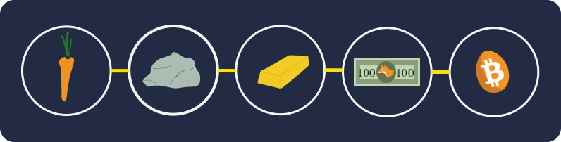

### Dalle conchiglie ai conti bancari

Oriinariamente la moneta era un bene tangibile, come il grano, il bestiame o un'altra materia prima. Tuttavia, questi beni avevano il grande svantaggio di essere deperibili, rendendo difficile il loro utilizzo come mezzo di risparmio a lungo termine. Ad esempio, un cattivo raccolto o bestiame ammalato potevano distruggere la ricchezza di un individuo da un giorno all'altro.

Con il progredire delle civiltà e l'espansione del commercio in nuove regioni, nacque l'esigenza di un mezzo di scambio universale. Gli individui sperimentarono dapprima oggetti come conchiglie e pietre preziose, ma non erano così resistenti o scarsi come si credeva. Alla fine l'oro divenne lo standard, grazie alla sua scarsità, resistenza e divisibilità. Era e rimane tuttora, un simbolo di ricchezza e potere.


### Qual è il ruolo del denaro?

Il denaro è uno strumento di comunicazione molto sofisticato:

- Permette di essere trasferito tra il presente e il futuro, perché trasforma il nostro tempo e la nostra energia del presente in un bene che può essere riutilizzato nel futuro, senza rischi di svalutazione.
- Facilita la comunicazione in un linguaggio universale: senza conoscersi o parlare la stessa lingua, due estranei possono scambiare, commerciare e concordare il valore delle cose.

La sua funzione nel nostro mondo è difficile da riprodurre artificialmente. Nessun individuo o gruppo può creare il denaro, poiché è un fenomeno naturale che deve emergere dal mercato e dal consenso volontario. In questo senso, i prezzi servono come segnali e informazioni che guidano la società nell'allocazione delle risorse.

Per questi motivi, l'oro come moneta è il risultato di 4.000 anni di darwinismo monetario basato sulle seguenti funzioni aristoteliche:

- Riserva di valore\*\*: il denaro può essere utilizzato per trasferire il potere d'acquisto nel futuro, quindi deve essere un materiale durevole;
- Mezzo di scambio\*\*: la moneta può essere utilizzata in cambio di beni e servizi al posto del baratto, evitando così la coincidenza dei desideri tra chi commercia;
- Unità di conto\*\*: il denaro ci permette anche di confrontare i valori di diversi beni per capire meglio la loro convenienza relativa.


### Le caratteristiche del denaro

L'oro soddisfa idealmente i criteri di una moneta efficiente: la sua naturale scarsità lo rende prezioso, mentre le sue proprietà chimiche fanno sì che non si deperisca nel tempo. Queste caratteristiche hanno reso l'oro una grande **riserva di valore**, ma non una moneta comune, perché questa forma di denaro non è facilmente divisibile o trasportabile su lunghe distanze. In un mondo globalizzato e digitale, l'oro fatica a tenere il passo e necessita di un'entità centrale che lo renda divisibile e facilmente scambiabile (ad esempio attraverso monete coniate).

All'opposto, le valute fiduciarie statali (fiat) sono facilmente utilizzabili, ma vengono costantemente svalutate dalle entità che le controllano (re, banche centrali, imperatori, dittatori).

Per spiegare meglio questo concetto, esploreremo le caratteristiche che rendono efficace una moneta:


- Fungibilità\*\*, ovvero intercambiabilità con un'altra unità dello stesso tipo senza perdita di valore;
- Divisibilità\*\*, in quanto può essere suddivisa in unità più piccole per facilitare le transazioni di volumi diversi;
- Liquidità\*\*, ovvero facilità di conversione in beni o servizi.

Per soddisfare questi criteri, la moneta si è storicamente evoluta attraverso passi differenti:

- Pietra grezza -> Moneta
- Banconota -> Carta di credito/debito
- Blockchain -> Lightning Network

Le valute si stanno evolvendo ancora oggi, adattando le loro forme per soddisfare diversi casi d'uso. Come abbiamo detto, l'oro, pur essendo un'eccellente riserva di valore, non è più adatto all'attuale economia globalizzata. Allo stesso modo, le valute fiduciarie come il dollaro e l'euro sono molto liquide e facilmente trasportabili perché ora sono per lo più digitali, ma il loro valore diminuisce costantemente a causa dall'inflazione monetaria.

D'altra parte, Bitcoin presenta nuove possibilità. Le sue proprietà, come l'emissione rigorosamente limitata, lo rendono un'eccellente riserva di valore. Inoltre, in quanto valuta neutrale di Internet, funge da valido **mezzo di scambio** che supera i confini. Tuttavia, oggi non è ancora ampiamente accettato nel commercio, nonostante la sua [costante adozione](https://btcmap.org/map).

## Valute fiduciarie

<chapterId>25151d46-7db1-5b48-8bba-cbde1944555a</chapterId>

> "Chi non ricorda il passato è condannato a ripeterlo" diceva George Santayana.
> Una verità che risuona con forza quando si parla dell'attuale sistema monetario.

### Fiduciario = Degno di fiducia <ma me pias no>

Oggi le principali valute, come l'euro e il dollaro, sono considerate fiduciarie. Ciò significa che non hanno un valore intrinseco e dipendono interamente dalla fiducia che riponiamo nelle istituzioni che le governano.

Una moneta fiduciaria è una forma di denaro decretata come tale da un'istituzione, cioè uno Stato, come la Cina con lo Yuan, o un'unione politico-economica, come l'Unione Europea con l'Euro. L'ente preposto alla sua emissione è la banca centrale (ad esempio, possiamo citare la People's Bank of China, la Federal Reserve degli Stati Uniti o la Banca Centrale della Repubblica di Guinea). Sono proprio questi enti che hanno il compito di delineare la politica monetaria e quindi la quantità di moneta da mettere in circolazione o da stampare.


### Svalutazione monetaria: una strategia antica quanto l'Impero Romano

Fin dall'antichità, l'oro è servito come riferimento monetario, ma la sua rigidità ha spesso portato i leader, sia gli imperatori romani che i governi moderni, ad adottare valute alternative, spesso fiduciarie.

Il meccanismo è semplice e si ispira a pratiche che esistono fin dalle origini della civiltà. I leader, desiderosi di esercitare il controllo sulla ricchezza, iniziano con la centralizzazione dell'oro, spesso sfruttando il loro potere e promettendo protezione e sicurezza. Con questa preziosa riserva nelle loro mani, introducono una nuova moneta equivalente in valore all'oro, ma coniata con la loro effigie. Questa moneta inizia a circolare e la gente si adatta rapidamente alla comodità del suo utilizzo semplice.

Tuttavia, questi leader iniziano a svalutare la nuova moneta in modo graduale, riducendo di fatto il suo valore di qualche punto percentuale ogni anno rispetto al prezzo iniziale dell'oro. Questa svalutazione silenziosa viene spesso giustificata come se fosse nell'interesse del popolo. In realtà, chi risparmia in questa moneta fiduciaria vede diminuire il valore dei propri risparmi, mentre lo Stato finanzia i propri progetti attraverso l'inflazione. Inoltre, questa svalutazione rende il debito più facile da ripagare.


Nei momenti di crisi, il leader fa l'annuncio: la moneta non è più sostenuta dall'oro. Il pubblico, ormai abituato alla moneta fiduciaria e spesso disinformato sulle questioni finanziarie, accetta questa realtà consentendo allo Stato di manipolare liberamente l'offerta di moneta e di stampare enormi somme di denaro a costo quasi zero.

La stampa di moneta porta quindi all'inflazione e impoverisce gradualmente la popolazione. Inoltre, il sistema finanziario è regolato e limitato per evitarne il collasso, dal momento che qualsiasi sconvolgimento potrebbe provocare una grave crisi economica. Contrariamente alle masse, le istituzioni finanziarie e gli individui ricchi traggono grandi vantaggi da questo sistema, che crea un divario nella disparità di ricchezza e favorisce l'autoritarismo. In questo contesto, non sono incentivati ad apportare cambiamenti radicali, permettendo al sistema di continuare il suo corso fino a una possibile implosione.

Se ben eseguita, questa strategia può durare per decenni. Tuttavia, è importante notare che una svalutazione molto rapida o una perdita di fiducia possono portare all'iperinflazione (vedi capitolo successivo). La storia dimostra che il dollaro ha perso il 98% del suo valore in 100 anni, l'euro il 30% in 20 anni e la sterlina il 99% dalla sua creazione.

Alla fine, la valuta potrebbe non avere più alcun legame con l'oro, come le monete romane alla fine dell'Impero, o addirittura ridursi a un semplice valore numerico, scollegato dalla realtà tangibile.

Oggi stiamo assistendo a una svolta storica. Il dollaro, che ha a lungo dominato, sembra essere in declino mentre l'oro ha perso il suo ruolo centrale. Siamo alle soglie di un nuovo ciclo monetario, che ci ricorda come le lezioni della storia sono spesso dimenticate

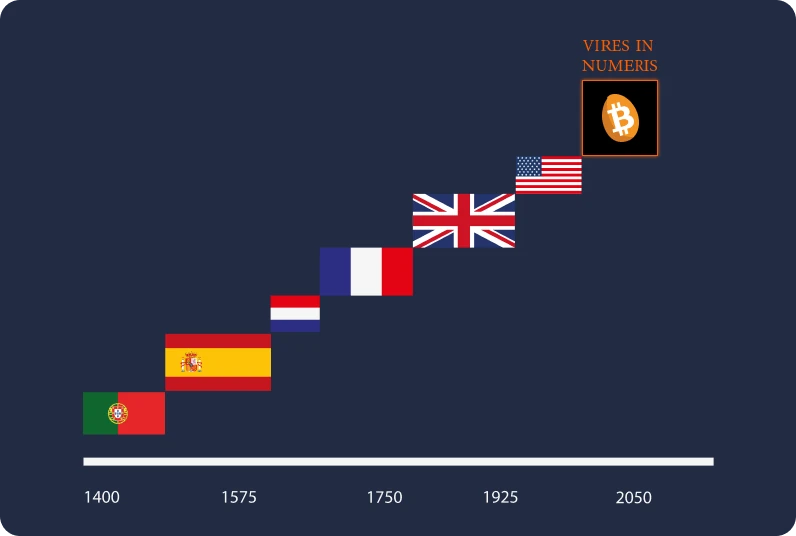

### Bitcoin è una soluzione?

Grazie a queste premesse, la rivoluzione di Bitcoin sta prendendo piede. A differenza delle valute precedenti, non richiede **nessuna terza parte fidata** e mira a separare lo Stato dal denaro.


Bitcoin si presenta a tutti gli effetti come una risposta a queste sfide sistemiche, proponendo una soluzione decentralizzata e un nuovo sistema monetario parallelo. Se nella storia l'oro è stato favorito come valuta per la sua resistenza alla contraffazione, allo stesso modo Bitcoin non può essere falsificato. Grazie alla sua natura decentralizzata e crittografica, è limitato a 21 milioni di unità. Bitcoin è una valuta che si basa sulla trasparenza e sulla neutralità, offrendo un'alternativa interessante all'attuale sistema monetario centralizzato.


Un altro motivo per cui Bitcoin ha attirato l'attenzione è l'emergere delle valute digitali delle banche centrali, o CBDC, che sembra inevitabile. Questa nuova forma di denaro svilupperebbe un'economia pianificata sempre più a livello centrale e potrebbe sia ostacolare la libertà finanziaria degli individui sia facilitare gli abusi autoritari.

Possiamo concludere questo capitolo con una citazione del premio Nobel F.A Hayek del 1984:

> "Non credo che potremo mai avere una buona moneta, prima di aver tolto la cosa dalle mani del governo. Se non possiamo toglierla dalle mani del governo con la violenza, l'unica cosa che possiamo fare è introdurre, in qualche modo furbo, qualcosa che loro non possono fermare".
> Per saperne di più sulle fallacie economiche e sulla libertà, vi invitiamo a scoprire il nostro corso ECO 102, che ripercorre la vita e le idee di Frédéric Bastiat, un intellettuale francese del XIX secolo che avrebbe sicuramente apprezzato la nascita di Bitcoin:

https://planb.network/courses/d07b092b-fa9a-4dd7-bf94-0453e479c7df

## Iperinflazione

<chapterId>b04c024c-54f3-50cb-997f-58721cfc74be</chapterId>

L'iperinflazione è un fenomeno monetario specifico delle valute fiat: è caratterizzata da una completa perdita di fiducia in una valuta e da un drammatico aumento dell'inflazione dovuto alla stampa di moneta da parte delle autorità. Di conseguenza i risparmi accumulati dalle persone possono disperdersi in un periodo di tempo relativamente breve, spingendo il Paese sull'orlo del collasso economico, sociale e politico.

### L'inflazione è fuori controllo!

Per capire l'impatto dell'inflazione sui risparmi, dobbiamo prendere in considerazione diversi tassi di inflazione.

- Con un'inflazione del 2%, si perde ogni anno il 2% del potere d'acquisto, il che equivale al 10% in 5 anni.
- Con il 7%, si perde la metà in 10 anni.
- Con il 20%, se ne perde quasi la metà in 3 anni.

Quando si verifica un'iperinflazione, non si parla più di un 20% all'anno, ma di un 20% al mese o, al suo apice, addirittura al GIORNO. Sperimentare un'inflazione del 100% al giorno per tre giorni è uno scenario realistico che si è verificato e continua a verificarsi nel mondo.

È fondamentale capire che l'iperinflazione non avviene per caso, per il capitalismo o per gli attacchi dei politici avversari. L'iperinflazione è la diretta conseguenza di politiche monetarie sbagliate, pianificate da banchieri centrali e politici. Le sue conseguenze si ripercuotono su ogni cittadino e hanno un impatto anche sulle generazioni future. Vi invitiamo a dedicare cinque minuti alla lettura della tabella seguente per rendervi conto del reale impatto di questo fenomeno (il corso ECO204 approfondisce ulteriormente l'argomento). Come potete vedere, nessun Paese o valuta è potenzialmente al sicuro.


### Quali sono le fasi dell'iperinflazione?

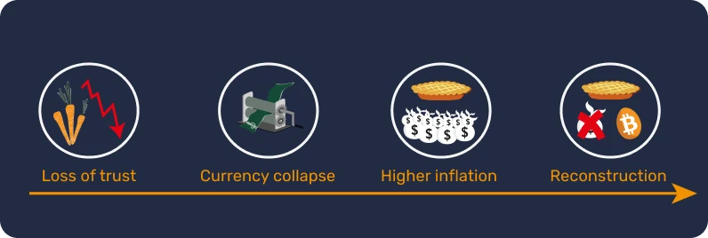

Affinché si verifichi l'iperinflazione, devono essere realizzate alcune condizioni.

Fase 1 - Perdita di fiducia

- La centralizzazione del potere monetario facilita la creazione di denaro e i suoi abusi. In questo contesto, alcuni fattori esterni possono innescare l'iperinflazione, tipicamente guerre, misure sociali o l'aumento del prezzo di risorse chiave come il grano o la benzina. Può quindi verificarsi una perdita di fiducia nella moneta e gli individui iniziano a mettere in dubbio l'origine del denaro e i benefici della politica monetaria fissata.

Fase 2 - Crollo della valuta e aumento dei prezzi

- Quando i governi perdono il controllo della fiducia, gli individui iniziano a scambiare la loro valuta con una più stabile, come è successo in Venezuela con il dollaro statunitense. Questa circostanza porta a un aumento dei prezzi, creando un circolo vizioso in cui beni e servizi diventano sempre più costosi. Per soddisfare queste esigenze e correggere la politica monetaria, lo Stato stampa più moneta provocando un'inflazione esponenziale.

Fase 3 - Il circolo vizioso della stampa di moneta

- Sono cosìono necessarie sempre più banconote per acquistare beni, con conseguente scarsità delle stesse. In risposta, i governi ricorrono alla stampa di altre banconote, alimentando ulteriormente l'inflazione.

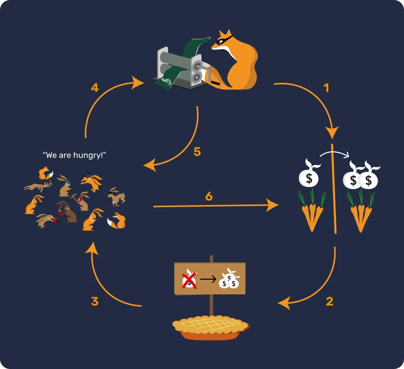

Fase 4 - L'emergere di una nuova moneta

- Viene quindi introdotta una nuova valuta per sostituire quella vecchia, al fine di interrompere il ciclo dell'inflazione attuando controlli più severi che non erano in vigore con la precedente moneta a corso legale.

Risolvere una crisi iperinflazionaria richiede spesso cambiamenti radicali, come rivoluzioni, cambi di governo, sostituzione dei banchieri centrali, ecc. La perdita di fiducia, il crollo della valuta e la ricostruzione sono fasi essenziali per far rinascere un'economia basata sulla valuta fiat.

### Tre esempi significativi

- Germania, 1922-1923.

Uno degli esempi più eclatanti di iperinflazione si è verificato nella Repubblica di Weimar, in Germania, dopo la prima guerra mondiale.

La Germania aveva preso in prestito enormi quantità di denaro per finanziare la guerra. Tuttavia, non solo perdette la guerra, ma dovette pagare miliardi di dollari in riparazioni. Il mese con il più alto tasso di inflazione fu l'ottobre 1923, con un picco del 29.500%, pari a un tasso di inflazione del 20,9% al giorno. I prezzi raddoppiavano ogni 3,7 giorni!

La moneta tedesca divenne così inutile che alcuni cittadini preferivano bruciare le banconote anziché la legna, perché era effettivamente più economica. Si racconta persino che nei ristoranti i camerieri dovessero annunciare i prezzi dei menu ogni 30 minuti per tenere conto dell'inflazione.

Alla fine, le autorità crearono una nuova moneta sostenuta dai debiti di Germania, Francia e Inghilterra e garantita dai terreni tedeschi.


- Ungheria, 1945-1946

Il Paese che ha vissuto la peggiore iperinflazione fino ad oggi è di gran lunga l'Ungheria dopo la Seconda Guerra Mondiale.

L'Ungheria si trovò dalla parte dei perdenti nel conflitto, con la maggior parte della sua capacità di produzione industriale distrutta. Il mese con l'inflazione più alta fu il luglio 1946, che vide una sconcertante inflazione dei prezzi del 41.900.000.000.000.000%, equivalente al 207% al giorno. I prezzi raddoppiavano ogni 15 ore!

L'ultima banconota a essere messa in circolazione fu un Pengo da 100 milioni di miliardi (100.000.000.000.000) nel 1946.


- Zimbabwe, 2007-2008

Fino al 2000, lo Zimbabwe era autosufficiente per quasi tutto il suo fabbisogno, tranne che per il petrolio.

Nel 1997, il dollaro dello Zimbabwe è crollato di oltre il 72% dopo che il governo ha accettato di risarcire i veterani di guerra per un importo equivalente a 450 milioni di dollari americani. Non disponendo di tale somma, il governo ha fatto ricorso alla stampa di moneta. Nel 2005 l'inflazione ha raggiunto il 586%, ma il picco è stato raggiunto a metà novembre 2008 con un tasso stimato al 79.600.000.000% al mese.

Nel giugno 2007 il governo ha reagito imponendo un controllo dei prezzi, ma questa azione non ha avuto alcuna influenza sull'economia. I negozi sono stati letteralmente "saccheggiati" e i commercianti non avevano più i mezzi per rifornirsi.

Nell'aprile 2009 il Ministro delle Finanze ha annunciato la sospensione del dollaro dello Zimbabwe e ha autorizzato l'uso di diverse valute estere per gli scambi commerciali. Tutti i conti bancari, le pensioni e le istituzioni finanziarie hanno visto svanire i loro saldi dall'oggi al domani.


In conclusione, l'iperinflazione ha l'effetto di deteriorare rapidamente il valore della moneta, portando all'erosione dei risparmi e alla perdita di fiducia nel sistema monetario. Come Voltaire ha dichiarato, una valuta fiat finirà sempre per perdere il suo valore intrinseco e convergere verso lo zero.

Una moneta che si basa sulla fiducia in una terza parte come un istituto finanziario è, in pratica e a lungo termine, una moneta difettosa, perché non è in grado di garantire il potere d'acquisto o di preservare i risparmi.

Per approfondire il tema delle iperinflazioni, vi consigliamo il corso ECO 204 di David St-Onge, dove imparerete cosa sono i cicli iperinflazionistici e il loro reale impatto sulla nostra vita. Scoprirete anche le analogie tra questi cicli e, soprattutto, come proteggervi da essi.

https://planb.network/courses/caa75343-ac90-4249-bcca-0e2e57c3a0f1

## 21 milioni di bitcoin

<chapterId>f4a06d76-1963-56fd-93ff-dfa41489bcde</chapterId>

### La politica monetaria di Bitcoin

Bitcoin è una moneta digitale decentralizzata con una quantità massima predefinita di **21 milioni di unità**. Questa caratteristica intrinseca di scarsità è determinata dal suo codice informatico e rafforzata dal consenso di tutti gli utenti che partecipano al protocollo.

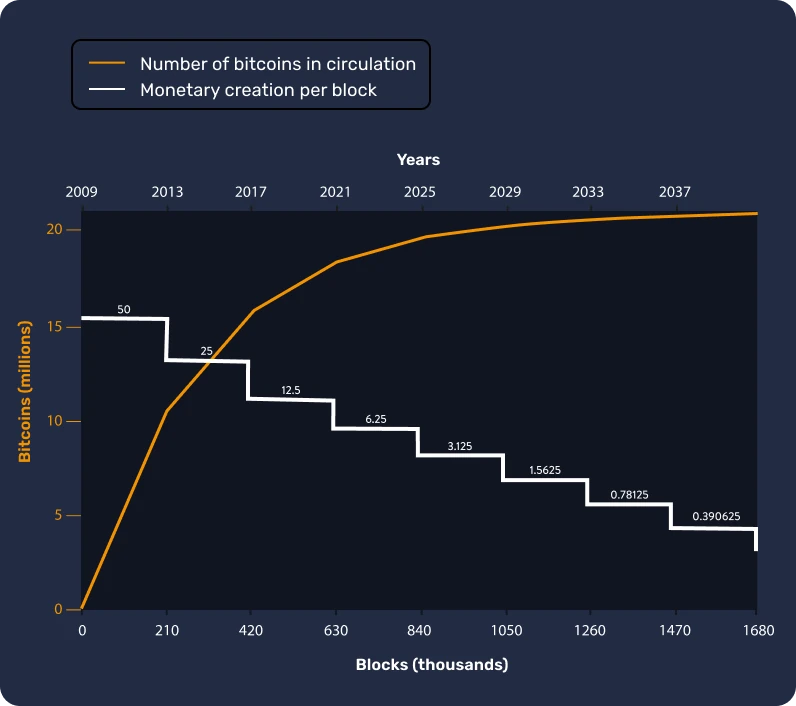

La sua emissione monetaria può essere illustrata da una curva che rappresenta la quantità di bitcoin creati nel tempo. Nel 2022, ad esempio, erano in circolazione circa 18,5 milioni di bitcoin. Le previsioni indicano che nel 2025 ci saranno in circolo circa 19,5 milioni di bitcoin, che rappresentano circa il 93% dell'offerta totale e, nel 2037, questa cifra raggiungerà i 20,4 milioni.

### Come vengono creati i nuovi bitcoin?

La creazione di nuovi bitcoin è il risultato del processo di mining. In poche parole, i miner utilizzano potenti computer per risolvere complessi problemi matematici, che convalidano e rendono sicure le transazioni. Una volta risolto un problema, il miner aggiunge un nuovo blocco alla blockchain, un registro decentralizzato e distribuito che registra tutte le transazioni effettuate sulla rete. La blockchain garantisce trasparenza e sicurezza, poiché ogni blocco è collegato al precedente, rendendo quasi impossibile alterare i dati precedenti senza il consenso della rete.

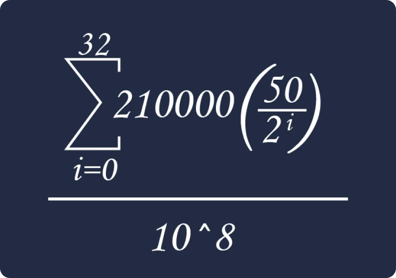

Dopo aver svolto con successo questo compito, i miner vengono ricompensati con l'emissione di nuovi bitcoin ogni dieci minuti. Questa ricompensa è programmata per dimezzarsi ogni 210.000 blocchi, cioè circa ogni quattro anni (un evento noto come "halving"), dando alla curva di emissione monetaria una forma a scala. Grazie a questo meccanismo, si può prevedere matematicamente che la creazione di nuovi bitcoin cesserà entro l'anno 2140, quando il numero totale raggiungerà il limite di 21 milioni.

| Numero di halving | Altezza del blocco | Ricompensa in BTC dopo l'halving | Stima dei BTC in circolazione dopo l'halving |

| -------------- | ------------ | ------------------------- | ------------------------------------------ |

| 1 | 210.000 | 25 BTC | 10.500.000 BTC |

| 2 | 420.000 | 12,5 BTC | 15.750.000 BTC |

| 3 | 630.000 | 6,25 BTC | 18.375.000 BTC |

| 4 | 840.000 | 3,125 BTC | 19.687.500 BTC |

| 5 | 1.050.000 | 1,5625 BTC | 20.343.750 BTC |

| 6 | 1.260.000 | 0,78125 BTC | 20.671.875 BTC |

| 7 | 1.470.000 | 0,390625 BTC | 20.835.937,5 BTC |

| 8 | 1.680.000 | 0,1953125 BTC | 20.917.968,75 BTC |

| 9 | 1.890.000 | 0,09765625 BTC | 20.958.984,375 BTC |

| 10 | 2.100.000 | 0,048828125 BTC | 20.979.492,188 BTC |

| 11 | 2.310.000 | 0,0244140625 BTC | 20.989.746,094 BTC |

| 12 | 2.520.000 | 0,01220703125 BTC | 20.994.873,047 BTC |

| 13 | 2.730.000 | 0,006103515625 BTC | 20.997.436,523 BTC |

| 14 | 2.940.000 | 0,0030517578125 BTC | 20.998.718,262 BTC |

| 15 | 3.150.000 | 0,00152587890625 BTC | 20.999.359,131 BTC |

| 16 | 3.360.000 | 0,000762939453125 BTC | 20.999.679,566 BTC |

| 17 | 3.570.000 | 0,0003814697265625 BTC | 20.999.839,783 BTC |

| 18 | 3.780.000 | 0,00019073486328125 BTC | 20.999.919,892 BTC |

| 19 | 3.990.000 | 0,000095367431640625 BTC | 20.999.959,946 BTC |

| 20 | 4.200.000 | 0,0000476837158203125 BTC | 20.999.979,973 BTC |

Rivedremo il concetto di mining in modo più dettagliato nel [capitolo sul mining](https://planb.network/courses/2b7dc507-81e3-4b70-88e6-41ed44239966/dbb8264a-7434-57e4-9d1b-fbd1bae37fdf).

### Garanzia di scarsità digitale

Il limite di 21 milioni è alla base della scarsità di Bitcoin ed è garantito da due meccanismi chiave: l'aggiustamento' della difficoltà di mining e la teoria dei giochi.

- L'aggiustamento della difficoltà di mining è un processo che avviene ogni 2016 blocchi, ovvero circa due settimane, per garantire che un nuovo blocco venga aggiunto alla blockchain in media ogni dieci minuti circa. Questa frequenza di creazione dei blocchi e la quantità totale di bitcoin sono entrambi aspetti immutabili del protocollo Bitcoin e non possono essere modificati senza un consenso generale, a differenza delle decisioni arbitrarie prese nei sistemi monetari tradizionali.

La difficoltà di trovare un hash valido segue una sorta di ciclo: se il numero di miner aumenta, significa che il numero di blocchi trovati è maggiore, il che porta a una diminuzione del tempo medio per trovare un blocco. Ne deriva l'aumento della difficoltà. Di conseguenza, il numero di blocchi che i miner trovano si riduce, il che significa che il meccanismo torna alla media di 10 minuti per blocco. Si veda l'immagine sottostante per una comprensione visiva.

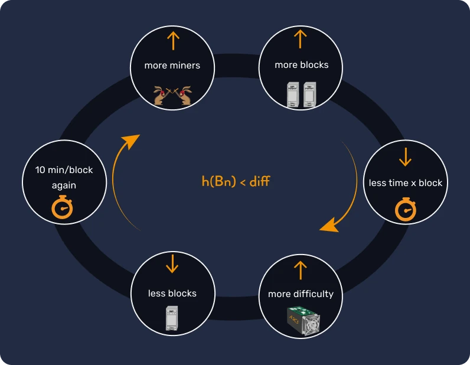

Sapevate che i miner sono incentivati a minare un blocco per guadagnare nuovi bitcoin attraverso la ricompensa di blocco e le commissioni di transazione delle transazioni che includono nello stesso?

Pertanto, man mano che il numero di bitcoin emessi si avvicina al limite di 21 milioni, i miner saranno remunerati più attraverso le commissioni associate ad ogni transazione, piuttosto che attraverso la ricompensa di blocco.

- La teoria dei giochi è un concetto matematico che si basa sulla razionalità umana. Presuppone che gli individui agiscano in modo logico, cercando di massimizzare i propri benefici e tenendo conto delle potenziali decisioni degli altri. In Bitcoin la teoria dei giochi aiuta a garantire che la maggioranza dei miner e degli utenti agisca nell'interesse della rete. Infatti, poiché le modifiche al protocollo sono votate dagli utenti, qualsiasi modifica al protocollo Bitcoin richiederebbe l'accordo dell'intera comunità, il che è molto complesso. Se qualcuno volesse creare un ventiduesimo milione di bitcoin, dovrebbe convincere tutti gli utenti a svalutare volontariamente i propri risparmi, il che è improbabile che accada perché Bitcoin è globale e non è governato da un gruppo centrale.

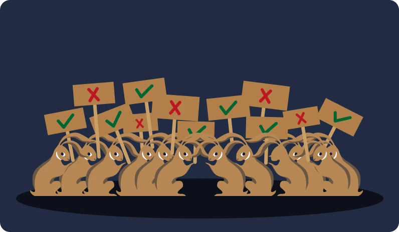

L'idea di svalutare la valuta è contraria alla filosofia alla base di Bitcoin, quindi è altamente improbabile che si verifichi una modifica della sua quantità complessiva.

### Una politica monetaria verificabile: ogni secondo, dall'inizio e per sempre!

La scarsità di Bitcoin è un punto di forza e la quantità massima di 21 milioni di bitcoin in circolazione è pubblica e verificabile da chiunque.

In realtà, chiunque può farlo attraverso un nodo Bitcoin (cioè un validatore di transazioni) semplicemente inserendo il seguente comando: `bitcoin-cli gettxoutsetinfo`. Questa trasparenza rafforza la fiducia nel sistema Bitcoin, che non si basa su istituzioni centrali o individui, ma piuttosto sulle garanzie matematiche e crittografiche insite nel suo protocollo (imparerete a farlo facilmente in LNP201).

```json
{
  "height": 710560,
  "bestblock": "0000000000000000000887384d67103412ea7f18a43953e65c8c4ac36bf42e54",
  "transactions": 473244,
  "txouts": 1018917,
  "bogosize": 2183872374,
  "hash_serialized_2": "eebb9987337700ffaacbbaa11223344",
  "disk_size": 178239584,
  "total_amount": 18745998.12345678
}
```

Bitcoin garantisce una sana gestione monetaria limitando l'emissione per design, il che lo rende molto diverso dalle altre valute perché può proteggere i risparmi degli utenti. In linea con i principi dell'economia austriaca, la sua quantità stabile e la distribuzione prevedibile lo proteggono dai rischi di inflazione che le valute tradizionali devono affrontare (per saperne di più, consultate il corso ECO201).

In sintesi, con la sua natura decentralizzata, la scarsità programmata e la trasparenza, Bitcoin offre un'alternativa unica ai sistemi monetari tradizionali. Illustra come la tecnologia possa essere utilizzata per creare una moneta che non solo sia utile e verificabile, ma che preservi anche il valore dei risparmi degli utenti limitandone rigorosamente l'offerta.

### Conclusione della sezione 1!

# Wallet Bitcoin

<partId>28860585-4f61-59d9-b242-f4c57d837cc1</partId>

## Cosa sono i wallet Bitcoin?

<chapterId>1c0166ab-cb7a-5bc6-9175-d13482bd91f1</chapterId>

Nella sezione 2, esploreremo l'archiviazione e la sicurezza di Bitcoin attraverso l'uso dei wallet, per capire dove si trovano questi famosi bitcoin e come interagire con loro!

### Sfatare i wallet Bitcoin

I wallet vengono utilizzati per interagire con la rete Bitcoin in tre modi principali:

- Per ricevere bitcoin
- Per inviare bitcoin
- Per proteggerli da tentativi di hackeraggio e furto

Un wallet Bitcoin può avere molte forme: un software sul computer, un'applicazione sullo smartphone, un dispositivo fisico come una chiave USB o persino un foglio di carta. Ognuna di queste formw serve casi d'uso diversi. Alcuni sono infatti progettati per grandi transazioni con un'enfasi sulla sicurezza, mentre altri danno priorità alla privacy, oppure sono destinati a pagamenti quotidiani di piccole somme.

I portafogli possono quindi essere classificati in ampie famiglie di utilizzo, sempre incentrate su una domanda chiave: siete i proprietari dei fondi o state lasciando il controllo del vostro denaro a terzi? Analizzeremo questo argomento in dettaglio nel prossimo capitolo, ma la domanda rimane semplice: il denaro è nelle vostre tasche o in quelle dei un banchiere?


### Come funziona un wallet Bitcoin?

Che si tratti del vostro "banchiere" Bitcoin o di voi stessi, la stragrande maggioranza dei wallet Bitcoin funziona con una tecnologia simile basata sulla crittografia asimmetrica, che prevede un sistema di coppie di chiavi: una chiave privata per spendere e una chiave pubblica per ricevere.

- Chiave privata

Quando si inizializza un wallet, viene generata una recovery phrase (chiave privata) che viene presentata all'utente sotto forma di 12 o 24 parole.

La chiave privata è fondamentale perché costituisce la proprietà dei bitcoin e quindi il diritto di utilizzarli o inviarli. Pertanto, il titolare della chiave privata è il vero proprietario dei bitcoin.

Questa chiave deve essere tenuta segreta e ben protetta, perché sblocca la vostra fortuna!

- Chiave pubblica e indirizzo

La chiave pubblica è generata dalla chiave privata ed è legata ad essa. Condividere la chiave pubblica comporta rischi per la privacy (perché gli altri utenti possono vedere il vostro saldo) ma non per la sicurezza (perché non possono spendere i vostri fondi senza possedere la chiave privata). A sua volta, la chiave pubblica viene utilizzata per creare indirizzi Bitcoin e quindi ricevere denaro.

Questi indirizzi vengono creati automaticamente dal wallet e possono essere condivisi in modo sicuro. Per massimizzare la vostra privacy, è consigliabile utilizzarli una sola volta.

In sintesi, questa tecnologia ci permette di ricevere bitcoin senza che il destinatario possa rubare i nostri fondi! Una cassetta della posta potrebbe essere una metafora calzante: le persone possono depositarvi denaro, ma voi siete gli unici a poterla aprire.


### I bitcoin sono nel wallet?

Sebbene le chiavi siano memorizzate nel wallet, i bitcoin stessi sono "memorizzati" nella blockchain Bitcoin, che è un registro pubblico distribuito all'interno della rete peer-to-peer Bitcoin (ne parleremo nella sezione 3). Ciò significa che la perdita del dispositivo contenente il wallet non comporta necessariamente la perdita dei bitcoin. Ciò che permette di ricreare il wallet e di spendere i bitcoin è in realtà la chiave privata, quindi ricordatevi sempre di proteggerla adeguatamente!

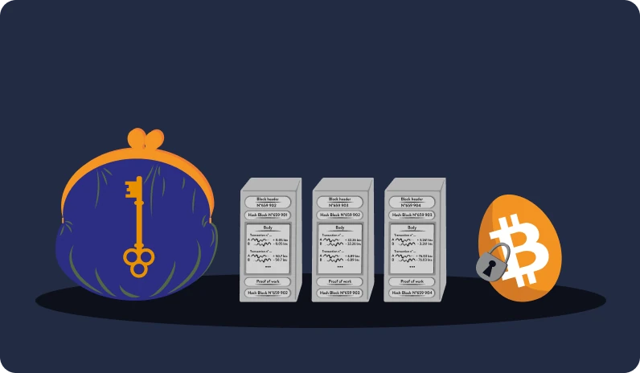

Fortunatamente, dal 2017, la chiave privata può essere rappresentata da un semplice elenco di 12 o 24 parole, noto come "frase mnemonica", che è abbastanza facile da salvare. Questa frase serve come backup per i vostri fondi e vi permette di ricreare il vostro wallet utilizzando qualsiasi software o app. Pertanto, chiunque trovi questo elenco di parole può accedere ai vostri bitcoin.

### E riguardo agli hacker?

Cosa succede se qualcuno indovina per sbaglio il nostro elenco di 12 o 24 parole? La risposta breve è che è altamente improbabile, grazie alla crittografia utilizzata per creare il wallet. Per intenderci, scoprire per sbaglio la vostra stessa frase mnemonica è come trovare il numero "giusto" compreso tra 1 e $2^256$, che è quasi equivalente a trovare l'atomo "giusto" nell'universo. Tuttavia, se non siete soddisfatti di questa sicurezza predefinita, potete sempre migliorarla aggiungendo una passphrase (una parola in più) al vostro wallet Bitcoin.

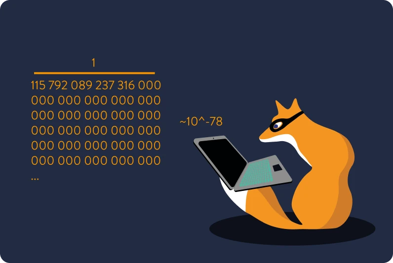

La probabilità di hackerare il vostro wallet Bitcoin è astronomicamente bassa, se seguirete le buone pratiche di sicurezza che illustreremo nella prossima sezione.

Ricordate di scegliere il wallet giusto per le vostre esigenze di utilizzo: tutorial dettagliati sulla gestione e la sicurezza dei diversi wallet sono disponibili nella [sezione tutorial della nostra università](https://planb.network/tutorials/wallet).

Se durante il vostro viaggio nella tana del coniglio volete saperne di più sul funzionamento di un wallet Bitcoin, dall'entropia alla creazione degli indirizzi, vi consigliamo il corso CYP 201 dedicato a questo argomento:

https://planb.network/courses/46b0ced2-9028-4a61-8fbc-3b005ee8d70f

## Wallet Bitcoin e sicurezza

<chapterId>00c1afea-e54a-511f-bab3-2efc2fbfa6a1</chapterId>

### Porsi le domande giuste prima di iniziare

Quando si possiedono bitcoin, la sicurezza dei propri fondi è una delle principali preoccupazioni. Il modo migliore per definire un livello di sicurezza adatto alla vostra situazione è porsi una serie di domande:

- Chi può accedere ai vostri fondi? In altre parole, avete accesso esclusivo ai vostri bitcoin o una terza parte (come una società) vi concede l'accesso ai vostri fondi?
- Come pensate di utilizzare i bitcoin in quel particolare wallet? Regolarmente? Per risparmiare a medio o lungo termine?
- Quali sono le sue competenze tecniche?
- Qual è il vostro budget per la sicurezza?

In realtà non esiste una risposta o una soluzione universale, quindi prendetevi il tempo necessario per rispondere a queste domande, che vi aiuteranno ad adattare le misure di sicurezza alle vostre esigenze.


### Pensare ai wallet Bitcoin in termini di complessità

Di seguito definiremo diversi livelli di sicurezza:

- Livello 0\*\*, utilizzate un cosiddetto "servizio custodial" in cui non siete gli unici detentori dei vostri bitcoin. Siate consapevoli che questa terza parte fidata può limitare l'accesso ai vostri fondi in qualsiasi momento. In questo caso, il vostro livello di sovranità finanziaria è simile a quello di un sistema bancario tradizionale con un conto corrente.

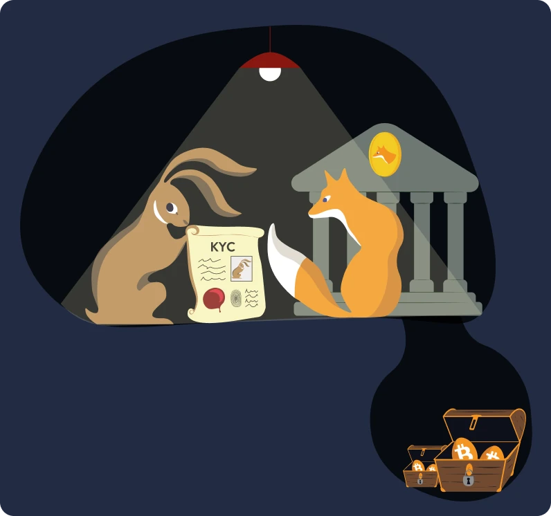

- Livello 1\*\*, si utilizza un wallet Bitcoin sul telefono o sul computer, dove si è gli unici detentori dei bitcoin e si possono effettuare facilmente le transazioni. Il suddetto strumento viene definito "hot wallet", perché la chiave privata viene memorizzata su un dispositivo con accesso a Internet. In questo caso, è fondamentale eseguire un backup della frase mnemonica per poter accedere nuovamente ai propri fondi in caso di perdita del telefono o del computer.

Ad esempio, è possibile utilizzare Sparrow Wallet come hot wallet:

https://planb.network/tutorials/wallet/desktop/sparrow-7e9a77c0-013d-4f8e-a811-408b71dc7607

- Livello 2\*\*, si utilizza un wallet fisico e l'elenco di 12/24 parole è protetto. Viene spesso definito "cold wallet" perché le chiavi sono memorizzate su un dispositivo non connesso a Internet. In questo caso, dovrete sempre firmare ogni transazione con il vostro dispositivo, il che rende i fondi meno accessibili su base giornaliera.

Ad esempio, si può utilizzare un Ledger, un Satochip o un Tapsigner:

https://planb.network/tutorials/wallet/hardware/ledger-nano-s-plus-75043cb3-2e8e-43e8-862d-ca243b8215a4
https://planb.network/tutorials/wallet/hardware/satochip-e9bc81d9-d59b-420d-9672-3360212237ba
https://planb.network/tutorials/wallet/hardware/tapsigner-ab2bcdf9-9509-4908-9a4a-2f2be1e7d5d2


- Livello 3**, si utilizza un wallet del livello 1 o 2, ma con una passphrase aggiuntiva. In questo caso, è necessario eseguire il backup sia dell'elenco di 12/24 parole **che\*\* della passphrase. Idealmente, queste due informazioni sono memorizzate in due luoghi diversi.

Per saperne di più sull'uso e sul funzionamento della passphrase BIP39:

https://planb.network/tutorials/wallet/backup/passphrase-a26a0220-806c-44b4-af14-bafdeb1adce7
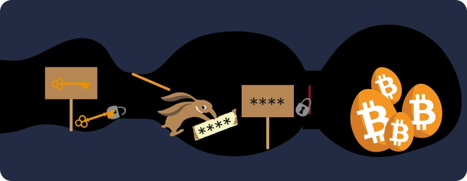

- Livello 4\*\*, si utilizza un insieme di wallet per creare un "multisig", il che significa che sono necessarie più firme per eseguire una transazione. In questo caso, occorre tenere presente che ogni parte del multisig deve essere memorizzata in luoghi diversi. Questo approccio è spesso considerato un uso avanzato di Bitcoin, principalmente per la gestione di grandi importi e per scopi aziendali.

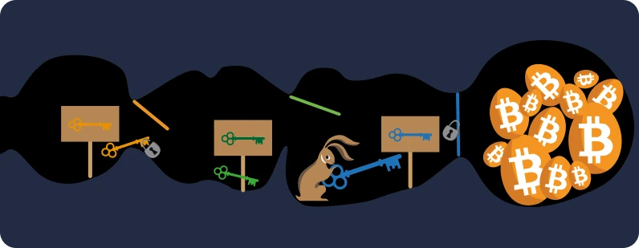

Naturalmente, casi d'uso diversi richiedono anche wallet diversi e non esiste una soluzione unica per tutti.

### La sicurezza deve essere adattata

L'importo che si è disposti a lasciare su uno specifico livello di sicurezza dipende da ogni individuo. Per alcuni, lasciare 1 BTC su un hot wallet è ragionevole, mentre per altri è il contrario. In ogni caso, quando si vuole mettere al sicuro una piccola somma, si consiglia di non spendere troppo per la sicurezza acquistando un dispositivo fisico. Inoltre, tenete presente che complicare eccessivamente la sicurezza e l'accessibilità dei vostri bitcoin può essere dannoso, soprattutto se gestite male i backup dei vostri wallet.

In conclusione, la proprietà diretta dei propri bitcoin è un elemento essenziale per garantire la sovranità finanziaria. Si consiglia di utilizzare un wallet mobile per le spese quotidiane e un fisico offline, o "cold", per conservare importi maggiori. Le aziende, invece, dovrebbero considerare l'utilizzo di sistemi multifirma, o "multisig", per una maggiore sicurezza comune. È inoltre essenziale evitare i servizi custodial, che possono riprodurre alcune vulnerabilità del sistema finanziario tradizionale.

Con queste premesse, possiamo passare alla sezione successiva in cui descriviamo come creare un wallet Bitcoin. Tuttavia, se volete approfondire l'argomento della sicurezza, potete leggere questo [articolo di DarthCoin](https://asi0.substack.com/p/bitcoin-soyez-votre-propre-banque).

## Impostare un wallet

<chapterId>615519eb-4565-557d-86a0-021badf7616f</chapterId>

La sicurezza dei vostri bitcoin è di importanza cruciale e un semplice errore può avere conseguenze disastrose. Ecco perché è necessario imparare le migliori pratiche da adottare quando si crea un nuovo wallet Bitcoin.

Il corso BTC102 vi guiderà in questa fase.

https://planb.network/courses/f3e3843d-1a1d-450c-96d6-d7232158b81f

### Questo passaggio non è uno scherzo!

Quando si configura un wallet il software crea la chiave privata, solitamente rappresentata da un elenco di 12/24 parole (spesso chiamate "seed phrase" o "frase mnemonica"): queste parole costituiscono l'accesso ai vostri fondi. Se questa chiave viene rivelata a terzi, i fondi associati devono essere considerati compromessi. Pertanto, quando si configura il proprio wallet, è essenziale seguire queste regole:

- Coprire tutte le telecamere.
- Non fotografare l'elenco delle parole.
- Non inserirle su un computer o un telefono.
- Non salvare le parole come contatto o inviarle a se stessi tramite SMS.
- Non lasciare mai le parole incustodite sulla scrivania.
- Non nascondere mai la lista di parole in un posto insolito.

Dovete letteralmente prendere un foglio bianco o stampare questo [modello](https://bitcoiner.guide/backup.pdf), e scrivere l'elenco di parole con una penna, seguendo l'ordine presentato in modo ordinato e ben leggibile. Tenete presente che se l'inchiostro si sbiadisce nel tempo, potreste perdere i vostri fondi. Ecco perché è importante tenere questo foglio di carta al riparo da fattori ambientali che potrebbero danneggiarlo, come l'umidità o il fuoco.

Qui di seguito trovate un esempio di compilazione del documento: le parole sono false, quindi non usatele!


### I nostri consigli per farlo bene

Prima di tutto assicuratevi di non commettere alcun errore durante la trascrizione delle parole, altrimenti i vostri eredi potrebbero faticare a leggere la copia e non riuscire a recuperare i fondi. Una volta salvate le parole, poi, è consigliabile creare una seconda copia e conservarla in un luogo diverso dalla prima. In questo modo si ha la certezza di avere un backup nel caso in cui l'originale venga perso o danneggiato.

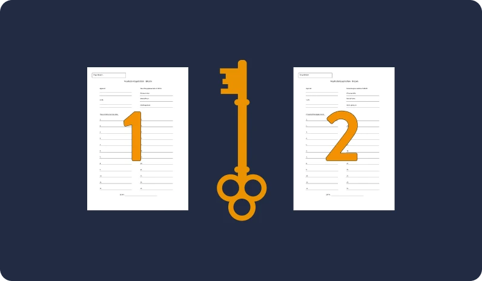

La lista delle parole dev'essere conservata in un luogo sicuro e da imparare facilmente. Evitate di creare piani di occultamento troppo complicati che potrebbero portare alla loro perdita.

**Le vostre parole = i vostri soldi.**

Sia i wallet "cold" che quelli "hot" utilizzano le parole come standard per il backup delle chiavi private. Di conseguenza è possibile inserire la frase mnemonica in qualsiasi software o dispositivo che funga da wallet per ripristinare l'accesso ai fondi. D'altro canto, sconsigliamo vivamente l'uso di wallet che non forniscono una frase mnemonica, perché potrebbero richiedere di fornire un numero di conto, o l'inserimento di un indirizzo e-mail o, peggio ancora, di un documento d'identità.

**ATTENZIONE: l'assenza di un elenco di 12/24 parole dovrebbe mettervi in guardia.**

Se poi volete scoprire, passo dopo passo, come creare il vostro wallet e ottenere i vostri primi bitcoin, vi consigliamo di seguire anche quest'altro corso:

https://planb.network/courses/f3e3843d-1a1d-450c-96d6-d7232158b81f

## Superare la prova del tempo

<chapterId>f58cd446-c202-5eff-aab7-e61cc40e5c06</chapterId>

Come ogni forma di ricchezza, anche i vostri bitcoin devono essere protetti da perdite, furti e deterioramento, soprattutto a lungo termine. La salvaguardia dei bitcoin richiede alcune conoscenze tecniche e la comprensione dei rischi associati, il che apre la strada a due strategie principali: Incidere la lista di parole su una piastra d'acciaio e pianificare l'eredità.

### Incidere sull'acciaio

Un metodo per proteggere i bitcoin a lungo termine è quello di incidere la frase mnemonica su un materiale resistente come l'acciaio, creando un backup fisico delle chiavi che sia resistente sia all'acqua che al fuoco.

Sono disponibili diverse soluzioni: alcune a basso costo, come "Blockmit", mentre altre possono richiedere attrezzature più specializzate. Potete approfondire questo argomento nella sezione [tutorial](https://planb.network/en/tutorials/wallet) della nostra accademia.


### Pensare alla prossima generazione!

Oltre a questa prima pratica, la pianificazione di un asse ereditario è un passo fondamentale per garantire che i bitcoin siano gestiti correttamente dopo la vostra morte. Questo piano prevede la stesura di una lettera in cui si delinea la natura dei propri beni, le modalità di accesso e le informazioni di contatto delle persone di fiducia che ne hanno la responsabilità. È inoltre importante discutere l'eredità in bitcoin con un notaio, per garantire la conformità fiscale; anche se il notaio non dovrebbe mai essere incaricato direttamente della gestione dei vostri bitcoin.

Se desiderate approfondire l'argomento del piano di successione per i vostri bitcoin, vi consigliamo di leggere il libro di Pamela Morgan [Cryptoasset Inheritance Plan] (https://planb.network/resources/books/28) o di iscrivervi al corso BTC102, in cui forniamo indicazioni sulla creazione del vostro piano.


### La privacy è importante

Oltre alla creazione di backup fisici o allo sviluppo di un piano di eredità, la privacy è un altro argomento importante quando si tratta della sicurezza a lungo termine di bitcoin. Ad esempio è preferibile acquistare bitcoin senza fornire un documento d'identità per ridurre al minimo i rischi di furto d'identità o di tracciamento dei fondi da parte di soggetti dotati degli strumenti giusti.

Per quanto riguarda la privacy, è fondamentale evitare di parlare in giro dei propri bitcoin. Non possiamo prevedere come questa tecnologia sarà percepita in futuro, quindi mantenere la discrezione sul vostro possesso è una scelta saggia: non vorrete attirare l'attenzione su di voi o sul vostro wallet.

Allo stesso modo, evitate di condividere apertamente i dettagli del vostro sistema di sicurezza durante gli incontri con altri bitcoiner o con gli sconosciuti...

### Sintesi sulla sicurezza dei wallet

I wallet Bitcoin sono software che consentono di memorizzare bitcoin e di effettuare transazioni. Ne esistono diversi tipi:

- wallet per cellulari o PC, comodi per piccoli importi e/o spese regolari;
- wallet fisici, più adatti a conservare bitcoin a medio e lungo termine;
- wallet multisig, che sono più complessi da gestire e richiedono più firme per eseguire le transazioni.

Quando si crea un wallet è necessario innanzitutto salvare l'elenco di 12 o 24 parole su un supporto di carta o su una piastra metallica. La cosiddetta frase mnemonica consente di ripristinare il wallet tramite qualsiasi applicazione software. Siate consapevoli che chiunque abbia accesso a questo elenco ha accesso anche ai vostri fondi.

Nel mondo Bitcoin, la sovranità finanziaria è strettamente legata alla responsabilità individuale, per cui è essenziale garantire l'accesso ai wallet e ai backup. A tal fine, è importante seguire alcune linee guida:

- Create un piano di successione per garantire che i vostri cari possano recuperare il denaro in caso di problemi.
- Evitate di lasciare i vostri Bitcoin sulle piattaforme exchange, perché possono essere soggette ad attacchi di hacker.
- Adattate il livello di sicurezza alle vostre esigenze e ai casi d'uso, per scegliere bene tra i diversi wallet disponibili.

Dopo aver trattato le basi dei wallet Bitcoin e le migliori pratiche per garantire la loro sicurezza, nel prossimo capitolo esploreremo le caratteristiche tecniche di Bitcoin. Ancora una volta, la comprensione delle basi del protocollo Bitcoin migliorerà la vostra comprensione del suo funzionamento, consentendovi di utilizzarlo al meglio.

# Gli aspetti tecnici di Bitcoin.

<partId>a86d7439-e7a2-5f21-b1e9-6b5e23ca265b</partId>

## Lancio di Bitcoin

<chapterId>b7561082-8943-519d-95d1-a5f60dd2686d</chapterId>

### Cominciamo con un po' di Storia.


Il 31 ottobre 2008 segna la nascita di una nuova tecnologia finanziaria: il Bitcoin. In questa data, Satoshi Nakamoto, l'autore anonimo di Bitcoin, presenta la sua innovazione al mondo attraverso una mail distribuita alla lista di diffusione cypherpunk, una comunità di criptografi appassionati di privacy su internet.

Questa mail conteneva un documento, chiamato "White Paper", che presentava il funzionamento di Bitcoin. Considerando i fallimenti precedenti dei sistemi di denaro digitale, questa iniziativa non ha suscitato un entusiasmo immediato. Tuttavia, questo White Paper è diventato una referenza per gli utenti di Bitcoin ed è stato oggetto di numerosi dibattiti nell'ecosistema Bitcoin.


Il 3 gennaio 2009, Satoshi inaugura ufficialmente la rete Bitcoin creando il primo blocco, chiamato anche blocco genesi, che segna il lancio della blockchain di Bitcoin. Questo blocco contiene un messaggio rivelatore della missione di Bitcoin: "03/jan/2009 Chancellor on brink of second bailout for banks" (Il cancelliere sull'orlo di un secondo salvataggio per le banche).


> "Possiamo vincere una battaglia importante nella corsa agli armamenti e ottenere un
> nuovo territorio di libertà da diversi anni." - Satoshi Nakamoto
> 

### Il protocollo Bitcoin inizia a prendere vita

L'8 gennaio 2009, Satoshi annuncia la pubblicazione di Bitcoin-0.1.0. Rapidamente, Hal Finney prende il software e si unisce alla rete. Da quel momento, c'erano 2 nodi, e quindi 2 minatori, nella rete. Finney immortala questo passaggio tweetando "Running Bitcoin". Il 12 gennaio 2009, viene effettuata la prima transazione Bitcoin tra Satoshi e Hal Finney. Questa transazione, di 10 BTC, viene registrata nel blocco 170.


L'interesse per il Bitcoin cresce rapidamente e molte persone iniziano a testare, dibattere, risolvere bug e riflettere sugli aspetti etici, economici e filosofici di Bitcoin. Per facilitare questi scambi, il forum BitcoinTalk viene creato il 22 novembre 2009 da Satoshi.
Questo forum diventa rapidamente il luogo di discussione preferito dagli utenti di Bitcoin. È qui che nascono molti meme e simboli associati a Bitcoin, come il [logo Bitcoin](https://bitcointalk.org/index.php?topic=64.0), il famoso [Hodl](https://bitcointalk.org/index.php?topic=375643.0) o addirittura [Pizza day](https://bitcointalk.org/index.php?topic=137.msg1195).

> **Lo sapevate?** Infatti, il 22 maggio 2010, Laszlo Hanyecz fa la storia di Bitcoin proponendo di comprare 2 pizze per 10.000 BTC. È la prima volta che il Bitcoin viene utilizzato per acquistare beni materiali.


### La scomparsa di Satoshi Nakamoto

Nel 2010, mentre il Bitcoin inizia a attirare l'attenzione dei media, Satoshi decide di prendere le distanze. Il 12 dicembre 2010, pubblica il suo ultimo post sul forum, annunciando la sua partenza. Il 23 aprile 2011, effettua il suo ultimo scambio privato conosciuto tramite e-mail. Satoshi scompare, lasciando la sua creazione nelle mani della comunità.

> "I governi sono bravi a tagliare le teste delle reti controllate centralmente come Napster, ma le reti P2P pure come Gnutella e Tor sembrano cavarsela da sole." - Satoshi Nakamoto

Nonostante l'assenza di Satoshi, il Bitcoin continua a svilupparsi. Ogni 10 minuti, la storia di Bitcoin viene scritta e il protocollo continua a funzionare come previsto. Non importa la paura, l'incertezza o il dubbio (FOMO per Fear Of Missing Out o FUD per Fear Uncertainty Doubt), il Bitcoin continua ad avanzare, con una disponibilità online del 99,988%.
Il Bitcoin è percepito in modo diverso da ogni individuo. Per alcuni, è un'entità fungina come il [micelio](https://brandonquittem.com/bitcoin-is-the-mycelium-of-money/), per altri è un [buco nero](https://dergigi.com/2019/05/01/bitcoins-gravity/i). Che si ami o si odii il Bitcoin, continua ad esistere, con il suo ritmo costante di 10 minuti per blocco, come il battito di un nuovo sistema monetario.

Per approfondire le conoscenze sugli scritti di Satoshi Nakamoto, consiglio il [libro di Phil Champagne](https://planb.network/resources/books) o il documentario di ARTE "il mistero di Satoshi".


> "Il problema fondamentale della valuta convenzionale è tutta la fiducia necessaria per farla funzionare. La banca centrale deve essere fidata di non svalutare la valuta, ma la storia delle valute fiat è piena di violazioni di tale fiducia. Le banche devono essere fidate di tenere i nostri soldi e trasferirli elettronicamente, ma li prestano in onde di bolle di credito con appena una frazione in riserva."

Ora che abbiamo alcuni elementi di contesto, vediamo come funziona in generale una transazione Bitcoin.

## Le transazioni Bitcoin

<chapterId>03482644-5473-590b-975b-b43bb65eac21</chapterId>

Una transazione Bitcoin è semplicemente un trasferimento di proprietà di bitcoin, utilizzando un indirizzo bitcoin. Prendiamo ad esempio due protagonisti: Alice e Bob. Alice desidera acquisire dei bitcoin, mentre Bob ne possiede già.

### Passaggio 1 - Creazione della transazione tramite il portafoglio

Affinché Bob possa trasferire dei bitcoin ad Alice, quest'ultima deve fornire a Bob uno dei suoi indirizzi bitcoin. Questo indirizzo, derivato dalla chiave pubblica di Alice, è unico per il suo portafoglio Bitcoin.

Concretamente, Alice apre il suo portafoglio e seleziona "ricevi". Un codice QR o un indirizzo come questo bc1q7957hh3nj47efn8t2r6xdzs2cy3wjcyp8pch6hfkggy7jwrzj93sv4uykr verrà visualizzato. È il suo "IBAN Bitcoin" in qualche modo. Quindi lo fornisce a Bob.

Successivamente, Bob inizia la transazione utilizzando l'indirizzo di ricezione di Alice. Bob apre a sua volta il suo portafoglio Bitcoin, seleziona "invia", copia e incolla l'indirizzo, aggiunge un importo e delle commissioni di transazione. Queste commissioni sono un incentivo per i minatori ad includere la transazione nel blocco successivo.

'

> **Perché pagare delle commissioni?** Queste commissioni sono essenziali per creare un mercato libero per l'inclusione delle transazioni nei blocchi, poiché il numero di transazioni presenti in un blocco è limitato. Infatti, un blocco ha una dimensione di 1 MB, che corrisponde a qualche migliaio di transazioni per blocco. Le commissioni di una transazione sono proporzionali alla sua dimensione. La dimensione della transazione, a sua volta, dipende dalla complessità della stessa.

> Per completare la transazione, Bob deve fornire una firma con la chiave privata degli indirizzi che utilizza per pagare Alice. Ciò permette di verificare che sia il proprietario dei Bitcoin che desidera trasferire. Questo passaggio viene generalmente eseguito automaticamente sui portafogli di tipo mobile, o è una conferma sul tuo portafoglio fisico: "Sei sicuro di inviare X a Y? Sì o no".

### Passaggio 2: La propagazione della transazione attraverso i nodi fino ai minatori

A questo punto, la transazione è stata creata e il portafoglio di Bob la condividerà quindi con la rete Bitcoin. Per farlo, il suo portafoglio comunicherà con un nodo della rete Bitcoin, e quest'ultimo diffonderà queste informazioni ad altri nodi. Questo passaggio di propagazione consente all'intera rete di visualizzare questa nuova transazione e di tenerne conto.


Nonostante questa transazione sia ora conosciuta da tutti (tramite uno strumento chiamato Mempool), la transazione potrebbe non essere considerata confermata! Infatti, sono i minatori che convalidano le transazioni inserendole in un blocco della nostra famosa blockchain.

I minatori hanno il compito di prendere le transazioni valide e non confermate, quindi di compilarle in un blocco. Affinché il loro blocco sia il prossimo della blockchain Bitcoin, devono risolvere un enigma crittografico in un processo chiamato "proof of work" o "prova di lavoro".


### Passaggio 3: La transazione viene estratta in un blocco da un minatore.

Questa prova di lavoro richiede di trovare un "hash" valido per il blocco in questione. Pensatelo come un'impronta digitale unica associata al blocco, composta da 256 caratteri. La validità di questo hash dipende dalla difficoltà della rete Bitcoin. Torneremo su questo meccanismo in dettaglio. Per ora, considerate che un minatore ha trovato un blocco valido e che la transazione di Bob per Alice è inclusa.

Questo nuovo blocco valido viene aggiunto alla blockchain Bitcoin, che è un registro pubblico e immutabile di tutte le transazioni Bitcoin. Pensatelo come un libro mastro comune a tutti gli utenti di Bitcoin. Secondo le regole del protocollo, un blocco viene aggiunto circa ogni dieci minuti grazie all'adattamento della difficoltà. Vedremo nella sezione sui minatori quale meccanismo impedisce la modifica del registro delle transazioni Bitcoin.


### Step 4: Il blocco è valido e verificato dal nodo del portafoglio di Alice.

A questo punto, la transazione è considerata valida, il minatore a sua volta propaga il nuovo blocco tramite il suo nodo alla rete e il portafoglio di Alice viene aggiornato.


> Attenzione: Anche se Alice nota di aver ricevuto bitcoin su uno dei suoi indirizzi, si consiglia di considerare la transazione come immutabile solo quando ha 6 conferme. Ciò significa che altri 6 blocchi sono stati minati sopra il blocco in cui si trova la transazione di Bob. In altre parole, più una transazione è antica nella blockchain, più è immutabile.


### Perché tutto questo?

Alla fine, il sistema di transazioni Bitcoin è decentralizzato e funziona in peer-to-peer, senza intermediari di fiducia.

Bob invia la sua transazione alla rete Bitcoin e quando un minatore pubblica un blocco valido contenente la transazione di Bob, Alice può iniziare a considerare quei bitcoin come suoi. La fiducia non è richiesta in nessuna fase del trasferimento di proprietà dei bitcoin; solo le regole del protocollo e gli incentivi economici rendono troppo costoso agire in modo malevolo all'interno del protocollo Bitcoin.

Gli utenti trasferiscono la proprietà dei loro fondi firmando digitalmente le transazioni con le loro chiavi private. I minatori hanno poco potere, poiché gli utenti hanno anche un controllo significativo attraverso i nodi Bitcoin che si occupano della validazione dei nuovi blocchi e delle transazioni incluse. È grazie a questa rete di nodi Bitcoin che la rete è veramente decentralizzata.

Infatti, per distruggere completamente la rete Bitcoin, sarebbe necessario distruggere tutte le copie della blockchain di tutti i nodi Bitcoin - un compito praticamente impossibile a causa della distribuzione geografica di questi nodi e della difficoltà di sequestrarli fisicamente.

Esaminiamo quindi più nel dettaglio il funzionamento di un nodo Bitcoin.

## I nodi Bitcoin

<chapterId>8533cebc-f799-528b-89df-8d75d4c37f1c</chapterId>

I nodi sono un elemento fondamentale dell'architettura della rete Bitcoin. Svolgono diverse funzioni cruciali:

- Mantenere una copia della blockchain di Bitcoin
- Validare le transazioni
- Trasmettere informazioni ad altri nodi
- Applicare le regole del protocollo Bitcoin.

Quindi, ogni dispositivo che esegue il software Bitcoin, chiamato nodo Bitcoin, (spesso tramite [Bitcoin Core](https://bitcoin.org/en/bitcoin-core/)) partecipa alla decentralizzazione della rete.


### I nodi sono quindi il nucleo centrale di Bitcoin.

Ogni nodo detiene una copia della blockchain, il che consente di verificare le transazioni ed evitare qualsiasi tentativo di frode. L'aspetto decentralizzato della rete conferisce a Bitcoin una straordinaria resilienza e robustezza: per fermare il protocollo Bitcoin, sarebbe necessario spegnere tutti i nodi in tutto il mondo. A titolo informativo, oggi (settembre 2023) ci sono circa [45.000 nodi](https://bitnodes.io/nodes/all/) distribuiti in tutto il mondo.

I nodi sono in grado di verificare la validità dei blocchi e delle transazioni perché seguono le regole del consenso di Bitcoin. Queste regole governano, tra le altre cose, la politica monetaria di Bitcoin, come l'importo della ricompensa per i minatori (che vedremo più in dettaglio nella prossima sezione) e la quantità di bitcoin in circolazione. I nodi agiscono in qualche modo come il sistema giuridico della rete. Grazie a loro, tutti i partecipanti alla rete seguono le stesse regole, garantendo la neutralità del protocollo Bitcoin. Le regole di consenso variano molto poco, se non affatto, perché per apportare modifiche è necessario ottenere l'approvazione di tutti i nodi.


La governance all'interno del protocollo è al di fuori del curriculum di questa formazione, ma sappiate che ogni utente che esegue un nodo Bitcoin decide le regole che desidera seguire. Pertanto, un utente potrebbe decidere di seguire altre regole (cioè apportare modifiche al codice), ma se queste modifiche invalidano le attuali regole di consenso, allora quel nodo non farà più parte della rete Bitcoin. Le modifiche importanti sono quindi rare e richiedono una coordinazione significativa tra migliaia di attori con ideologie e interessi diversi, il che costringe il protocollo a produrre solo aggiornamenti che lo rendono "migliore" nel senso di tutti gli utenti di Bitcoin.

### Come appare un nodo?

Ci sono diverse opzioni quando si desidera avere il proprio nodo, e i costi di manutenzione variano. È possibile semplicemente eseguire il software Bitcoin Core sul proprio computer, ma ciò richiederà uno spazio di archiviazione considerevole poiché la blockchain occupa circa ~500 GB. Per ovviare a questa limitazione, è possibile decidere di memorizzare solo gli ultimi N blocchi, si parla quindi di "nodo ridotto" (Pruned node). Per questo tipo di soluzione, il costo è trascurabile poiché il nodo è acceso solo quando ne hai bisogno.


Un'altra opzione è utilizzare hardware dedicato a questo scopo, come il Raspberry Pi 4 con un disco rigido SSD sufficientemente grande (circa ~1 TB). Questa seconda opzione è più costosa se devi acquistare l'hardware, ma dal punto di vista del consumo energetico rappresenta meno di 10€ all'anno.
Dall'aspetto della larghezza di banda, considerando 1 blocco di 1 MB ogni 10 minuti, ciò rappresenta circa 5 GB al mese.

### I nodi devono rimanere accessibili per tutti!

Il costo accessibile e l'accessibilità di un nodo Bitcoin dal punto di vista delle risorse hardware, dello storage e della larghezza di banda sono aspetti molto importanti perché facilitano la decentralizzazione della rete.

Infatti, tutti hanno una buona ragione per far funzionare un nodo! Il prezzo e gli sforzi sono minimi per il beneficio ottenuto. Basta lanciarsi nell'avventura e unirsi a migliaia di altri bitcoiner perché insieme formiamo la rete Bitcoin.


Ad esempio, se i blocchi fossero 100 volte più pesanti, potremmo certamente effettuare 100 volte più transazioni ogni 10 minuti, ma far funzionare un nodo Bitcoin richiederebbe un disco rigido da 50 TB, una larghezza di banda di oltre 500 GB al mese e un hardware in grado di convalidare centinaia di migliaia di transazioni in meno di 10 minuti. In questa situazione ipotetica con blocchi 100 volte più grandi, far funzionare un nodo Bitcoin non sarebbe accessibile al comune dei mortali, compromettendo la decentralizzazione del protocollo e l'immutabilità delle transazioni e delle regole di consenso. Pertanto, i vincoli del protocollo sono stati scelti anche per consentire al maggior numero possibile di persone di far funzionare il proprio nodo Bitcoin.

Questa situazione non è così ipotetica perché il 2017 è stato segnato da una intensa controversia, nota come "guerra dei blocchi". Questo conflitto ha opposto gli attori che desideravano modificare Bitcoin aumentando la dimensione dei blocchi per aumentare la capacità di transazione, a coloro che cercavano di preservare l'indipendenza e il potere degli utenti. Alla fine, gli utenti e i nodi hanno trionfato respingendo la proposta di modifica avviata dai minatori, dalle piattaforme di scambio e dalle istituzioni.

In seguito a questa vittoria, i nodi hanno attivato un aggiornamento chiamato SegWit, aprendo la strada all'implementazione di Lightning Network, una rete di pagamento Bitcoin istantanea che utilizza la blockchain di Bitcoin. Questa situazione dimostra che gli utenti, grazie ai loro nodi, hanno un potere reale all'interno di Bitcoin, che permette loro di affrontare le grandi istituzioni.


## I minatori

<chapterId>dbb8264a-7434-57e4-9d1b-fbd1bae37fdf</chapterId>

> I minatori servono a garantire la sicurezza della rete e ad aggiungere le transazioni ai blocchi. Utilizzano elettricità tramite macchine ASIC per risolvere la prova del lavoro di Bitcoin.


### Spiegazione della prova del lavoro

La Prova di Lavoro, alias "Proof of Work" (POW), è il consenso di sicurezza del protocollo Bitcoin. È la regola che permette a Bitcoin di funzionare e garantirne la robustezza. Il POW è alla base di tutto e svolge un ruolo cruciale nella teoria dei giochi di Bitcoin.

Pensalo come una grande lotteria a cui tutti possono partecipare. L'obiettivo è trovare un numero specifico che consentirà di firmare un blocco valido, il vincitore riceve una ricompensa in bitcoin. Questo numero è molto semplice da verificare, ma difficile da trovare. Infatti, la verifica facile avviene attraverso la funzione di hash SHA-256 che è inclusa nell'algoritmo di mining. Per trovare questo numero, i partecipanti (miner) proveranno miliardi e miliardi di possibilità come 1, 52, 2648, 26874615, 15344854131318631, ecc.

Se il numero scelto è quello giusto: Jackpot! Altrimenti, si continua a cercare. Per ottimizzare il numero di tentativi, utilizzeranno macchine specifiche chiamate ASICS che hanno il solo compito di calcolare miliardi di possibilità al secondo. La quantità totale di tentativi si chiama HashRate e permette di quantificare la sicurezza del protocollo Bitcoin. Per far funzionare queste macchine, quindi, è necessario consumare grandi quantità di elettricità. Il POW trasforma quindi l'energia in moneta, collegando il mondo reale e il mondo digitale per creare la prima valuta energetica.

Le macchine girano e dopo una media di 10 minuti, emergerà un vincitore. Avrà trovato l'hash corretto sotto la soglia di difficoltà. Il grande e unico vincitore firmerà quindi il nuovo blocco del server timestamp e continuerà la catena di blocchi. Il vincitore riceve le sue ricompense e torna a tentare la fortuna per il prossimo blocco. Il processo si ripete da 12 anni e ogni 10 minuti, un vincitore conferma le transazioni Bitcoin continuando a proteggere le transazioni passate. Rendendo la nostra blockchain Bitcoin più robusta e sicura.

Ogni 2 settimane (2016 blocchi), l'aggiustamento della difficoltà riequilibra il gioco globale del mining in base al numero di partecipanti.


### Il mining è in costante evoluzione

Negli anni, i miner si sono dotati di hardware informatico sempre più efficiente per produrre il maggior numero possibile di hash al secondo (chiamato HashRate) consumando il minor quantitativo di energia possibile, nel modo più economico possibile. I primi miner come Satoshi o Hal Finney minavano semplicemente con la loro CPU, poi altri hanno iniziato a minare con la loro scheda grafica. Oggi, i miner utilizzano ciò che viene chiamato ASIC (Application-Specific Integrated Circuit), macchine progettate appositamente per applicare l'algoritmo SHA256.


L' **Hashrate** della rete Bitcoin rappresenta in qualche modo la quantità di tentativi effettuati al secondo per trovare il prossimo blocco. Oggi è di circa 400 TH/s, ovvero 400.000 miliardi di tentativi al secondo! Più alto è l'hashrate globale, più difficile è per un attore malevolo monopolizzare le risorse necessarie per ottenere la maggioranza del mining e effettuare una doppia spesa. È quindi più economicamente vantaggioso seguire le regole del protocollo Bitcoin anziché agire in contrasto con esse. Ciò solleva una question: come vengono remunerati i minatori?


### Cosa si può trovare in un blocco?


L'intestazione del blocco contiene diversi elementi come l'ora, la difficoltà target, il numero dell'ultimo blocco, la versione utilizzata e il Merkel Root delle transazioni precedenti.

La transazione coinbase è sempre la prima; essa comprende la ricompensa ricevuta per aver svolto il lavoro di validazione. Seguono le transazioni validate. Il minatore sceglierà le transazioni che generano il maggior profitto e cercherà di creare un blocco che massimizzi il suo guadagno, ovvero transazioni di piccole dimensioni con il massimo delle commissioni.

### Remunerazione dei minatori

Inizialmente, un minatore viene remunerato quando trova un blocco valido. Più precisamente, viene remunerato in due modi: (i) tramite la ricompensa inclusa nel blocco e (ii) tramite le commissioni delle transazioni incluse nel blocco. L'importo della ricompensa è definito dalle regole di consenso e dipende dall'epoca in cui ci troviamo.

Infatti, per i primi blocchi la ricompensa era di 50 bitcoin, poi ogni 210.000 blocchi (circa ogni 4 anni) viene divisa per 2. Oggi (nel 2023) ci troviamo nella quarta epoca; la ricompensa è quindi di 6,25 bitcoin. Questa ricompensa è il meccanismo di creazione di moneta in Bitcoin. Poiché la ricompensa diminuisce nel tempo, ciò significa che esiste un limite di 21 milioni di bitcoin - oggi ci sono già più di 19,4 milioni di bitcoin in circolazione, ovvero oltre il 92%.


Il secondo metodo di remunerazione è definito dall'importo scelto dagli utenti per le commissioni delle transazioni. Poiché il minatore desidera massimizzare il suo guadagno, avrà la tendenza a selezionare prioritariamente le transazioni con commissioni elevate; le commissioni delle transazioni riflettono quindi l'urgenza dell'utente nel far inserire la sua transazione nel prossimo blocco.


Inoltre, per stabilizzare il modello economico dei minatori, che si basa sulle ricompense che ricevono per ogni blocco valido, i minatori spesso collaborano in gruppi attraverso "pool di mining", dove condividono le loro risorse di calcolo.

### Perché preoccuparsi di fare tutto questo?

In sostanza, l'innovazione di Bitcoin è quella di proporre una soluzione al problema della doppia spesa attraverso l'utilizzo di una blockchain basata sulla Proof of Work con una difficoltà variabile. Nel mondo digitale, il concetto di proprietà è diverso da quello del mondo fisico. Infatti, nel mondo digitale, tutto può essere copiato e incollato, il che crea problemi in termini di doppia spesa per i beni digitali di valore. Sono stati creati intermediari di fiducia, come le banche, per risolvere questo problema tecnologico e garantire che quando un bene viene trasferito, non appartenga più all'emittente. Ma come fare senza intermediari di fiducia? Questo problema è equivalente al problema dei generali bizantini, un problema di coordinamento delle informazioni in un sistema in cui non si può fidare dei diversi attori.


Bitcoin è quindi una sorta di soluzione per risolvere questo problema, o almeno per aggirarlo. I "general" di Bitcoin, o miner, producono blocchi (di informazioni) e i nodi Bitcoin verificano le transazioni finanziarie attraverso le regole di consenso per garantire l'autenticità delle informazioni. L'asimmetria nel costo energetico tra la produzione di informazioni e la verifica assicura l'affidabilità delle informazioni, senza bisogno di terze parti di fiducia.

I miner sono i costruttori della sicurezza della rete Bitcoin. Spendendo energia per produrre hash, costruiscono un muro che rende estremamente costoso per un agente malintenzionato riscrivere la cronologia delle transazioni. Questo disincentivo economico li dissuade dal comportarsi in modo disonesto.

Anche nel caso di un attacco del 51%, cioè quando un agente possiede più della metà della potenza di hash, la rete rimane sicura perché l'attaccante deve spendere la stessa quantità di energia di tutti i miner per cercare di modificare la blockchain. È grazie a questo meccanismo di proof of work, che richiede energia per essere completato, che la rete è sicura.

### In sintesi

La teoria dei giochi applicata a Bitcoin esclude i minatori disonesti. I minatori utilizzano macchine ASIC per estrarre e ricevono una ricompensa in caso di successo. Inoltre, spesso si uniscono in pool di mining per condividere la potenza di calcolo ed ottenere ricompense minori ma più regolari. Il mining di Bitcoin è un processo con un alto costo energetico, ma essenziale per il funzionamento e la sicurezza della rete Bitcoin. La prova del lavoro e la blockchain risolvono il problema della doppia spesa e garantiscono l'autenticità delle informazioni senza bisogno di terze parti di fiducia. La spesa energetica è necessaria per produrre le informazioni, ma la verifica delle informazioni ha un costo trascurabile. Questa asimmetria garantisce la sicurezza della rete. Pertanto, è più economicamente conveniente seguire le regole del consenso piuttosto che infrangerle.


Se desideri approfondire l'argomento specifico del mining su Bitcoin, puoi consultare il nostro corso MIN 201. Scoprirai il funzionamento e il ruolo del Proof-of-Work, nonché i meccanismi dell'industria del mining. Ti spieghiamo anche come trasformare un ASIC in un sistema di riscaldamento, per minare i tuoi primi satoshi riscaldando la tua casa!

https://planb.network/courses/min201

## Bitcoin e l'ecologia

<chapterId>4b227ae6-443a-5739-b443-60b7931130d9</chapterId>

Abbiamo appena visto nella sezione precedente che la sicurezza del protocollo Bitcoin si basa su un alto costo energetico per produrre un registro pubblico delle transazioni senza terze parti di fiducia. Il costo energetico complessivo è spesso paragonato al consumo elettrico di un piccolo paese. Ma questo confronto ha senso? È pertinente per capire le ragioni di un tale costo?

### I costi energetici di Bitcoin.

Innanzitutto, valutiamo qualitativamente il costo ambientale del mining. Un minatore deve dotarsi di una macchina come un ASIC e di una fonte di energia sotto forma di elettricità per alimentare queste macchine. Gli ASIC sono composti principalmente di alluminio e possono essere riciclati o riutilizzati per un secondo scopo (come dimostrato dal progetto [Attakaï](https://decouvrebitcoin.fr/attakai/), che trasforma un Antminer S9 in un riscaldamento supplementare). Il vero problema è quindi il consumo energetico. Cerchiamo quindi di fornire ulteriori contesto a questo.


Il consumo energetico rappresenta quasi la totalità dei costi per un minatore. Pertanto, è incentivato a procurarsi una fonte di elettricità a basso costo. Tuttavia, poiché i minatori sono mobili, possono recarsi in luoghi dove sono installate centrali elettriche ma non ancora collegate alla rete elettrica del territorio. I minatori svolgono il ruolo di acquirenti di ultima istanza, consentendo così alle centrali di finanziarsi prima ancora di essere collegate alla rete elettrica. E quando lo saranno, la domanda di elettricità aumenterà, aumentando il prezzo e rendendo meno redditizio per il minatore procurarsi elettricità in quei luoghi. Il minatore deciderà quindi di spostare la sua installazione e si stabilirà in un luogo dove la domanda è bassa e quindi anche il prezzo.

### Un dibattito senza fine

Così, il dibattito sull'impatto ecologico di Bitcoin è spesso mal indirizzato, principalmente a causa di una comprensione insufficiente della sua utilità e del suo funzionamento. Bitcoin non può essere valutato semplicemente in termini di costo energetico per transazione, poiché i minatori garantiscono sia la rete attuale che quella storica, le transazioni sono raggruppate e non sono tutte equivalenti, inoltre l'impatto di Lightning Network non viene preso in considerazione. Coloro che sostengono che Bitcoin consuma troppa energia possono avere motivazioni politiche o cercare di vendere la propria soluzione blockchain. Il pretesto ecologico viene utilizzato per giustificare il divieto di Bitcoin.

Tuttavia, non bisogna dimenticare che Bitcoin, come invenzione rivoluzionaria, ha dato alle persone che vivono sotto l'oppressione finanziaria o sotto un regime dittatoriale un modo per lottare per la propria libertà. Come ultima risorsa, Bitcoin offre una forma di libertà finanziaria sfuggendo alla censura e alle restrizioni bancarie. Bitcoin è più di una semplice valuta. È una forma di comunicazione ed espressione della libertà. L'energia spesa dai minatori contribuisce alla difesa della nostra libertà. Bitcoin consente l'emancipazione dal sistema finanziario attuale, dominato dal debito e dalla creazione monetaria eccessiva delle banche centrali.


Per coloro che vivono in paesi con un'alta inflazione, Bitcoin è una questione di sopravvivenza. Fornisce un modo per sopravvivere in situazioni finanziarie precarie. Inoltre, Bitcoin offre un sistema finanziario più giusto ed equo. Offre anche l'opportunità a miliardi di persone nel mondo di accedere al sistema finanziario. Visto da questo punto di vista, il consumo energetico è legittimo?

### Il Bitcoin potrebbe non essere un netto positivo per l'ambiente?

Infine, è essenziale discutere delle implicazioni economiche e ambientali dell'adozione di Bitcoin.

In particolare, confrontandolo con l'attuale sistema finanziario. Quest'ultimo, incoraggiando il sovraconsumo e l'indebitamento, pone seri problemi. Il facile accesso al credito, l'emissione di denaro da parte delle banche e l'uso della riserva frazionaria sono tutti fattori che incoraggiano il sovraindebitamento e, di conseguenza, il sovraconsumo.


Il sistema monetario deve essere riformato per riflettere la scarsità delle nostre risorse con la scarsità del nostro denaro. Questo incoraggerà un consumo più responsabile e una visione a lungo termine. Al contrario, l'inflazione, incoraggiando i consumi e gli investimenti, ha un impatto negativo a lungo termine sull'ambiente.

L'attuale sistema finanziario è in linea con le idee dell'economia keynesiana che, a differenza dell'economia austriaca, non tiene conto dell'aspetto temporale e dinamico delle situazioni e delle risorse. In altre parole, una moneta illimitata non può riflettere efficacemente le risorse limitate del nostro pianeta.


I politici, a causa della loro visione a breve termine e del loro bisogno di crescita economica per essere rieletti, non sono in grado di risolvere i problemi ecologici a lungo termine. Al contrario, l'adozione di una moneta sana come il Bitcoin è una potenziale alternativa che potrebbe restituire il potere economico al popolo.

Le fiamme dei pozzi di petrolio, che bruciano metano per evitare l'inquinamento, possono essere spente dai minatori di Bitcoin, a tutto vantaggio dell'ambiente. Il Bitcoin promuove l'uso di energia verde. Il gas metano può essere convertito in elettricità per alimentare le macchine di mining, il che è un bene per tutti.

La tecnologia di Bitcoin è spesso fraintesa e le critiche al suo impatto ecologico sono spesso semplicistiche e miopi. Queste critiche sono spesso motivate da ragioni politiche. Il Bitcoin ha il potenziale per aiutare la transizione ecologica e contribuire a un mondo più verde. I media spesso diffondono idee sbagliate sul Bitcoin e sull'ecologia. Prendetevi quindi il tempo necessario per farvi una vostra idea. Con il Bitcoin tutto è trasparente.

> Seguite una delle massime di Bitcoin: non fidarti, verificalo! (Dont trust, verify!)


### Breve riassunto degli aspetti tecnici di Bitcoin

Satoshi Nakamoto lancia nel gennaio 2009 il protocollo Bitcoin, che da allora si è evoluto grazie a una crescente comunità di sviluppatori, miner e utenti con nodi Bitcoin. Questi ultimi, mantenendo la propria copia della blockchain Bitcoin, il registro pubblico di tutte le transazioni Bitcoin, possono assicurarsi la validità delle transazioni secondo le regole di consenso specifiche di Bitcoin. In particolare, assicurandosi che i miner producano blocchi validi, che contengono alcune migliaia di transazioni in sospeso.

In media, viene creato un blocco ogni 10 minuti e il miner che trova un hash valido per il prossimo blocco viene ricompensato dal protocollo con una ricompensa il cui importo è definito dalle regole di consenso, e le commissioni di transazione di tutte quelle presenti nel blocco valido in questione. Poiché il risultato dell'algoritmo di hash (SHA256) per un determinato input è considerato imprevedibile, il processo di mining consiste nel costruire molti blocchi candidati e verificare se il loro hash è valido o meno. Tuttavia, per garantire che il tempo medio tra due blocchi rimanga costante (~10 minuti) indipendentemente dalla quantità di miner e dalla loro potenza di calcolo, la difficoltà nel trovare un hash valido viene regolata ogni 2016 blocchi, ovvero circa ogni 2 settimane. Nel tempo, i miner hanno sviluppato macchine specifiche per SHA256, chiamate ASICS, per aumentare il rapporto hashrate/joule, che significa essenzialmente il numero di tentativi al secondo e l'energia consumata.

Per essere il più redditizio possibile nella propria attività, il miner deve procurarsi l'elettricità più economica possibile, che spesso si trova in luoghi remoti, all'interno di centrali elettriche che non sono ancora collegate alla rete elettrica del territorio. Il miner agisce quindi come un acquirente di ultima istanza e, non appena il prezzo dell'elettricità aumenta a seguito di un aumento della domanda, tende a rilocare la propria attività altrove.

Così, il protocollo Bitcoin è un sistema monetario inattaccabile e inarrestabile perché ogni componente del protocollo è distribuito geograficamente in tutto il mondo - ad esempio, si contano circa 40.000 nodi Bitcoin su tutti i continenti. Le regole di consenso di Bitcoin sono tali che è economicamente più conveniente seguirle piuttosto che cercare di trasgredirle e, di conseguenza, non è richiesta alcuna fiducia tra gli attori. Bitcoin non ha un leader e non può essere fermato. È possibile regolare le piattaforme di scambio per limitare Bitcoin, ma ciò è limitato in termini di impatto. In sintesi, nessun giudice o stato può censurare o fermare Bitcoin.

# Come procurarsi Bitcoin?

<partId>517e1bb7-f032-51a0-930a-a91fe5148d3f</partId>

## Bitcoin non dorme mai!

<chapterId>d5e35e41-ea26-5478-8eb9-07daf9dff508</chapterId>

Il prezzo di Bitcoin è spesso caratterizzato da una significativa volatilità. Il suo valore può fluttuare considerevolmente in base alle variazioni del mercato e alle fasi di mercato rialzista (bull market) e ribassista (bear market). Questo è presente nel 100% dei mercati finanziari, compreso il bitcoin.


> Per fare semplice: gli esseri umani comprano tutti contemporaneamente e vendono tutti contemporaneamente. Il Bitcoin non è immune alla natura umana.

### Comprendere le onde di adozione

Lo sviluppo e l'evoluzione di Bitcoin sono in gran parte legati ai diversi gruppi di attori che hanno gradualmente integrato il suo ecosistema.


- I credenti:

I primi utenti di Bitcoin erano principalmente tecnologi, cypherpunks, libertari e sostenitori dell'oro. Questi gruppi sono stati attratti dal Bitcoin per la sua capacità di offrire soluzioni come denaro elettronico senza intermediari di fiducia, resistenza alla censura o politica monetaria trasparente e immutabile.

- Il dark web e i criminali

Successivamente, l'uso di Bitcoin si è esteso a siti di commercio sul dark web, come Silk Road, a causa della sua natura incontrollabile e pseudonima. Questo sito ha attirato l'attenzione sulla natura incontrollabile e pseudonima di Bitcoin, spingendo alcuni attori criminali a utilizzarlo. Tuttavia, è importante notare che l'uso che viene fatto di uno strumento, e non lo strumento stesso, determina la sua legalità o illegalità. Va notato che l'uso illegale di Bitcoin non rende una persona un criminale di per sé. È l'uso, e non lo strumento, che può essere classificato come illegale. Ad esempio, l'uso di Bitcoin per attività come l'acquisto di determinate droghe può essere legale o illegale a seconda della regolamentazione del territorio in cui si svolge l'attività.

- La febbre delle ICO e l'arrivo del grande pubblico

Il 2017 è stato segnato da una grande bolla speculativa nell'universo delle criptovalute, in particolare con il lancio di migliaia di ICO (Initial Coin Offering). Tuttavia, molte di queste nuove criptovalute non avevano né uno sviluppo concreto né un'utilità e sono quindi scomparse rapidamente. Questa bolla del 2017 è stata seguita da una forte correzione nel 2018-2019.

- La bolla dei NFT e la DeFi

Poi di nuovo nel 2020, il mercato ha attraversato un'altra bolla speculativa che ha portato il prezzo di Bitcoin a $60.000. Questa bolla si distingue dalle precedenti per una maggiore diversificazione degli investitori, comprese istituzioni finanziarie e grandi aziende. Ma ancora una volta, una volta passata l'euforia, si verificano forti correzioni.

### Bitcoin & la volatilità

Dati i cicli passati, sembra che la periodicità dei cicli economici di Bitcoin sia equivalente alla durata tra due halving. Forse perché l'evento dell'halving funge da detonatore riducendo della metà l'emissione di nuovi bitcoin.

### Bitcoin & la volatilità

Queste fluttuazioni molto importanti hanno creato una reputazione per Bitcoin come un asset estremamente pericoloso che fa perdere soldi a tutti i suoi utenti. Anche se il prezzo può diminuire del 10-20 o addirittura del 50% in pochi giorni, è importante capire che Bitcoin, il protocollo, non è influenzato dai cambiamenti di prezzo.

Questa volatilità significativa è completamente accettata oggi dagli attori di Bitcoin e può essere mitigata da diverse soluzioni come gli hedge finanziari (stablecoin), una forte convinzione a lungo termine (hodl) o semplicemente non mettendo il 100% dei propri soldi in Bitcoin senza capire nulla. Comprendere perché il prezzo di Bitcoin fluttua così tanto è quindi essenziale per poter progredire in questa industria perché alla fine è il prezzo e i cicli che temporizzano e regolano in qualche modo il nostro mercato. Tuttavia, possiamo notare che più Bitcoin cresce e matura, meno è significativa la volatilità.


Anche se la coppia btc/dollari fluttua nel breve termine, Bitcoin, grazie alla sua quantità limitata di 21 milioni di bitcoin e al suo processo di halving (divisione per 2 della creazione monetaria ogni 4 anni in media), segue un trend generale al rialzo in modo quasi meccanico. Ovviamente, come ogni asset finanziario, Bitcoin è soggetto a cicli economici che comprendono periodi di euforia, bolle speculative e correzioni. Questo fenomeno è abbastanza comune nelle tecnologie emergenti, dove il mercato non è sempre razionale o efficiente.

### Un mercato unico

Questi cicli di bolle speculative sono abbastanza unici nel loro genere, infatti è molto raro per lo stesso asset vedere così tante bolle che si susseguono ancora e ancora. Questo si spiega semplicemente perché Bitcoin non è una bolla destinata a scomparire, ma una valuta effettivamente utilizzata in tutto il mondo. Il protocollo Bitcoin è unico nel senso che funziona a livello globale, 24 ore su 24, 7 giorni su 7, rendendo la regolamentazione difficile per le autorità finanziarie.


Oggi, nel 2023, Bitcoin continua a sopravvivere e a crescere sempre di più, implementandosi sempre di più nel mercato tradizionale. L'arrivo imminente degli ETF Bitcoin, una regolamentazione più chiara e migliori strumenti di acquisizione o conservazione non fanno che incoraggiare questa tendenza. Bitcoin è ANCORA sopravvissuto alla sua bolla speculativa, quindi forse non è solo fumo!


## Ottenere bitcoin lavorando

<chapterId>be2d83be-406f-582c-83ca-6aa905ff7b04</chapterId>

### Si sviluppa un'economia parallela

Il bitcoin può essere considerato un'economia parallela rispetto alle valute fiduciarie. Ciò significa che è possibile vendere beni o servizi e essere pagati in bitcoin. Le transazioni possono essere effettuate direttamente in bitcoin, senza la necessità di passare attraverso una piattaforma di scambio, semplicemente da portafoglio bitcoin a portafoglio bitcoin.

L'economia di bitcoin esiste e si sviluppa in alcune regioni del mondo, come ad esempio El Salvador, dove il bitcoin è una valuta legale dal 2021. Inoltre, alcune persone, aziende e organizzazioni accettano già il bitcoin come metodo di pagamento per i loro prodotti o servizi.


Inoltre, per facilitare l'uso di bitcoin nelle transazioni quotidiane, è stato lanciato un progetto open-source e collaborativo: BTCMap (https://btcmap.org/map#2/21.28937/5.46680). Questo progetto elenca tutti i commercianti che accettano bitcoin e le diverse comunità bitcoin in tutto il mondo. Puoi visitare il loro sito per scoprire l'ecosistema bitcoin intorno a te. Quindi, nonostante le difficoltà e le resistenze, esistono iniziative come BTCMap che contribuiscono a rendere l'economia di bitcoin più accessibile e pratica per tutti.

### Perché accettare bitcoin invece di acquistarli?

Per ottenere bitcoin, puoi acquistarli su piattaforme regolamentate da enti come l'AMF (Autorité des Marchés Financiers) in Francia. Questo metodo comporta alcuni rischi e la tracciabilità delle tue transazioni. Un altro metodo per ottenere bitcoin è accettarli come metodo di pagamento per i prodotti o servizi che offri. Questo metodo ti consente di ottenere bitcoin attraverso il tuo lavoro senza doverti preoccupare costantemente del prezzo di bitcoin.

Inoltre, accettare bitcoin come commerciante offre diversi vantaggi, tra cui l'assenza di censura, commissioni di transazione ridotte, maggiore efficienza, protezione dall'inflazione, nonché libertà e sovranità finanziaria.


### Come fare:

Per accettare bitcoin, è necessario studiare le diverse soluzioni disponibili e scegliere quella più adatta alla tua azienda. Non esistono soluzioni perfette e diversi fattori devono essere presi in considerazione per fare la tua scelta, come ad esempio il volume di transazioni previsto, il budget assegnato, il tipo di attività commerciale (online o fisica).

Affronteremo questo argomento in dettaglio in un altro corso, ma per semplificare, possiamo considerare diverse categorie di attività commerciali e quindi soluzioni correlate:

- Soluzione online semplice: OpenNode

https://planb.network/tutorials/merchant/merchant/open-node-e69a0c1c-47f7-4932-8494-e6f26c3c9784

- Soluzione per commercianti amatoriali: Swiss Bitcoin Pay

https://planb.network/tutorials/merchant/merchant/swiss-bitcoin-pay-2-a78b057e-ed11-47ac-860c-71019fcb451a

- Soluzione per grandi strutture o appassionati di Bitcoin: BTCpay Server

https://planb.network/courses/btc305

Altre soluzioni intermedie o concorrenti a queste scelte esistono ovviamente, le scoprirete man mano che vi immergerete nel mondo di Bitcoin. Se necessario, la sezione tutorial per i commercianti può guidarvi!

## Risparmiare con Bitcoin

<chapterId>1d9570c6-5b63-51a6-b87c-7bdb0fc4aa87</chapterId>

### Avvertimento prima di iniziare!

Bitcoin è diventato un importante asset finanziario, principalmente a causa della sua offerta limitata e della crescente domanda. Tuttavia, l'acquisto di Bitcoin comporta rischi che richiedono particolare attenzione. È quindi consigliabile effettuare le proprie ricerche e approfondire l'argomento per familiarizzare con la tecnologia prima di investire.

- Investi solo ciò che puoi permetterti di perdere.
- Bitcoin è un asset finanziario molto volatile; il suo prezzo può scendere a 0.
- Le performance passate non sono indicative delle performance future.
- Contatta il tuo consulente finanziario se necessario.

> Plan ₿ Network non fornisce consulenza sugli investimenti e nulla di ciò che viene affermato qui deve essere considerato come tale.

### Mini check-list prima di fare il grande passo

Prima di avventurarti nell'acquisto di Bitcoin, assicurati di avere:

- Un portafoglio sicuro.
- Una solida comprensione di Bitcoin.
- Un piano di risparmio da seguire.
- Una visione a lungo termine.

Se l'argomento non è ancora chiaro, sappi che il corso BTC102 ti guiderà nella sicurezza e nell'acquisizione dei tuoi primi bitcoin. Qui, affronteremo solo superficialmente l'argomento.

Concretamente, ci sono due domande da porsi:

- Quale strategia di acquisto adottare: gradualmente o in una sola volta?
- Attraverso quale piattaforma passare: regolamentata o non regolamentata?

### Le strategie di acquisto

- Dollari Cost Average

L'acquisto ricorrente consiste nell'acquistare piccole quantità di Bitcoin a intervalli regolari. Questo metodo offre una mediazione del prezzo nel tempo e una crescita continua della quantità di Bitcoin posseduta. È una soluzione ideale per risparmiare a lungo termine senza preoccuparsi del prezzo e della volatilità di Bitcoin. Si imposta e si dimentica.


> Attenzione agli UTXO: Non dimenticare di consolidare i tuoi UTXO nel tuo portafoglio di tanto in tanto. Questa pratica è essenziale per gestire efficacemente i tuoi bitcoin ed evitare spese inutili durante le transazioni. Nel corso del tempo e del tuo percorso di studi imparerai le diverse implicazioni nel consolidare i tuoi UTXO.

- Acquisto spontaneo

L'acquisto spontaneo viene utilizzato per ottenere un'esposizione immediata a Bitcoin. Che si tratti di acquistare durante una caduta dei prezzi o di approfittare di un bonus, la decisione spetta a voi. Dovrete prendere coraggio e premere su acquista.
'Considerata la significativa volatilità di Bitcoin, è necessario prestare particolare attenzione alle proprie emozioni. Il FOMO (Fear of Missing Out, ovvero la paura di perdere un'opportunità) e il FUD (Fear, Uncertainty, Doubt, ovvero la paura, l'incertezza e il dubbio) sono i tuoi peggiori nemici in questo contesto! Rimanete calmi e seguite la strategia che avete stabilito in anticipo per evitare decisioni impulsive e potenzialmente dannose.

### A chi acquistare i nostri Bitcoin?

Esistono diversi modi per acquistare Bitcoin, ognuno con le proprie regolamentazioni. Alcune piattaforme richiedono un documento d'identità per la verifica, mentre altre no. È fondamentale comprendere le regolamentazioni associate ad ogni piattaforma.

- Le piattaforme di DCA

Un metodo comune per accumulare Bitcoin è il "Dollar Cost Averaging" (DCA), che consiste nell'investire regolarmente piccole somme. Diverse piattaforme offrono questo servizio, come quelle elencate nella nostra [pagina dedicata](https://planb.network/tutorials/exchange). Oltre alla semplicità di impostare un DCA, il prelievo verso il vostro portafoglio è generalmente automatico, il che significa che avrete sempre il controllo sul vostro agente.

Oggi quasi tutte le soluzioni di DCA sono relativamente efficienti e con commissioni quasi simili, la scelta si baserà maggiormente sulla disponibilità nel vostro paese.

- Piattaforme di broker

Per investimenti di grande entità, sono consigliate piattaforme regolamentate e riconosciute come Kraken, Bitstamp e Paymium. Queste piattaforme offrono un ambiente sicuro e protetto per transazioni di grandi volumi.

Il loro utilizzo è semplice e accessibile a tutti:

1. Creazione di un account KYC/\*
2. Trasferimento bancario sul vostro account
3. Acquisto di Bitcoin
4. Prelievo dei Bitcoin nel vostro portafoglio


Dopo l'acquisto, è consigliabile ritirare immediatamente i Bitcoin dalle piattaforme di scambio per ridurre al minimo i rischi di hacking e blocco dei fondi. Le commissioni di prelievo possono essere elevate, talvolta fino a 25 euro a seconda della piattaforma.

> Le norme Know Your Customer (KYC) obbligano gli utenti a fornire un documento d'identità al fine di contrastare il finanziamento del terrorismo, l'evasione fiscale e il riciclaggio di denaro.

È importante notare che il KYC è un argomento importante nel nostro settore poiché la sua efficacia rimane facilmente dibattuta mentre i suoi aspetti negativi sono numerosi. In molti corsi e contenuti dell'università, sconsigliamo di utilizzare piattaforme full KYC se siete già utenti avanzati.

### Soluzione non-KYC'

Inoltre, ci sono diverse [piattaforme di mercato](https://planb.network/tutorials/exchange) per acquistare e vendere bitcoin peer-to-peer. Se sei interessato a queste, puoi seguire il nostro corso BTC 205 sull'argomento. In generale, queste soluzioni sono:

- ATM bitcoin
- Incontri fisici con altri appassionati di bitcoin
- Piattaforme peer-to-peer, che non richiedono documenti d'intentita
- Soluzioni per mettere in contatto privati
- Soluzioni di neo-banche operanti in nazioni amiche di Bitcoin.


È anche importante notare che potrebbero essere applicate imposte nella tua giurisdizione. Ti invitiamo a consultare la normativa del tuo paese prima di intraprendere qualsiasi azione che potrebbe metterti in difficoltà.

## Hyper-bitcoinizzazione

<chapterId>b7275d31-3b60-5fb7-b9f5-030097010553</chapterId>

### La corsa pazza è appena iniziata!

Come ogni nuova tecnologia, l'adozione di Bitcoin segue una curva a S. Abbiamo superato l'era dei primi adottanti e gli indicatori sembrano convergere verso una completa democratizzazione di Bitcoin. È una tecnologia virale che non può essere fermata. El Salvador ha fatto la scommessa audace di adottare Bitcoin in modo totale, dichiarandolo una valuta a corso legale. Tuttavia, ogni paese reagisce in modo diverso a questa tecnologia. Alcuni l'hanno vietato e criminalizzato il suo utilizzo, aggiungendo complessità all'adozione di Bitcoin a seconda delle culture, delle epoche e delle nazioni.


La crescita di Bitcoin obbliga le aziende, le università, i regolatori e i privati a prendere in considerazione questa nuova tecnologia. Nuovi strumenti devono essere creati, i servizi devono essere adattati e l'innovazione deve continuare per garantire la loro sopravvivenza. Questo contesto solleva molte domande che riguardano diversi settori, tra cui la crittografia, la teoria dei giochi, l'economia e la politica monetaria, l'informatica, la filosofia, l'energia, le leggi e la regolamentazione. Insomma, Bitcoin è un oggetto multidisciplinare.


### Bitcoin è un 0 a 1

Ti invitiamo a riflettere su questa nuova rivoluzione monetaria. Ci sono così tante cose da esplorare con Bitcoin che è difficile assimilare tutto in una volta. Prenditi il tuo tempo, Bitcoin non scomparirà. Al contrario, la rivoluzione è appena iniziata. Insieme, crediamo di essere in grado di creare il mondo che vogliamo lasciare ai nostri figli. Un mondo in cui la sovranità umana è un diritto, in cui la privacy è rispettata per impostazione predefinita e in cui la moneta non è manipolata. Speriamo di riuscirci insieme.


Se desideri approfondire le tuo conoscimento sul Bitcoin, un gran numero di autori, pensatori, saggisti hanno contribuito alla parte educativa di Bitcoin. Da alcuni anni, stiamo catalogando e classificando queste opere per offrire una [biblioteca di risorse](https://planb.network/resources) ai più curiosi tra voi. Troverai i migliori podcast, siti web, articoli, tutorial, libri e altri contenuti.

> Milton Friedman, un rinomato economista, aveva previsto nel 1999: "Penso che Internet sarà una delle principali forze per ridurre il ruolo del governo. L'unica cosa che manca, ma che presto verrà sviluppata, è una moneta elettronica affidabile - un metodo mediante il quale su Internet puoi trasferire fondi da A a B senza che A conosca B o B conosca A." Oggi, il Bitcoin risponde a questa previsione.

# Il futuro di Bitcoin: Lightning Network

<partId>899fd35e-39e6-5a25-a73e-6fed6e725094</partId>

## Breve introduzione a Lightning Network

<chapterId>b403f1e4-f1ff-572b-a242-9b58cb3736d0</chapterId>

Ora che abbiamo le basi del protocollo Bitcoin, introdurremo una rete di pagamento che utilizza il protocollo Bitcoin per consentire transazioni a velocità fulminea. Stiamo ovviamente parlando di Lightning Network!

### In poche parole

Lightning Network è una tecnologia rivoluzionaria che ha profondamente modificato la nostra percezione di Bitcoin. È una soluzione che risponde alla questione della scalabilità di Bitcoin.

Per comprendere bene Lightning Network, è fondamentale capire come evolve il Bitcoin. Il Bitcoin si sviluppa in strati infrastrutturali: il primo strato è la blockchain, e il secondo strato è Lightning Network.


Riconosciuto come uno strato di Bitcoin, Lightning Network è stato convalidato e implementato nel 2017. Consente di effettuare transazioni istantanee in Bitcoin a basso costo, risolvendo così il problema della scalabilità di Bitcoin. Ma quale è questo problema di scalabilità che il Bitcoin incontra?

### Una blockchain non può crescere all'infinito

Il problema della scalabilità o della dimensione corrisponde alla sfida di creare un sistema monetario in grado di gestire un numero di transazioni al secondo sempre crescente man mano che viene adottato. Questo si riferisce al trilemma delle blockchain. Immagina un triangolo con i vertici: decentralizzazione, sicurezza e scalabilità.


Un protocollo basato su una blockchain può soddisfare solo due di questi 3 aspetti. All'interno del protocollo di Bitcoin, sono state fatte scelte che favoriscono la decentralizzazione/sicurezza. Infatti, da un lato, la dimensione dei blocchi di 1MB e il tempo tra due blocchi (in media 10 minuti) consentono di far funzionare un nodo Bitcoin a basso costo, favorendo la decentralizzazione. D'altra parte, la produzione di blocchi tramite Proof-of-Work rende estremamente costosa la frode all'interno del protocollo, facilitando la verifica da parte dei nodi della rete e favorendo così la sicurezza. Tuttavia, queste scelte impongono un limite al numero medio di transazioni in un blocco, che corrisponde approssimativamente a poche transazioni al secondo. Questo numero è ridicolo se confrontato con la capacità dei processori di pagamento come VISA, che è di 1700/s. Tuttavia, è un limite necessario per poter effettuare transazioni in modo incensurabile e senza intermediari di fiducia con Bitcoin. Tuttavia, le persone che sviluppano su Bitcoin hanno riflettuto su questo problema fin dall'inizio.

### Lightning come livello superiore

Dopo anni di riflessioni e numerosi tentativi, il protocollo Lightning emerge. Utilizzando un certo numero di specifiche, questo protocollo consente di costruire una rete di pagamento peer-to-peer utilizzando la sicurezza e la programmabilità delle transazioni del protocollo Bitcoin. Lightning Network funge da rete di canali di pagamento, consentendo transazioni istantanee e a basso costo per il mittente. Questa rete di canali di pagamento rende possibile persino le transazioni tra individui che non hanno un canale direttamente connesso tra di loro.


I servizi di trasferimento di denaro tradizionali, come Western Union, le banche centrali, Visa e Mastercard, potrebbero scomparire se non adottano la tecnologia Lightning Network. Lightning Network è più efficiente ed economico rispetto ai sistemi di pagamento attuali. Infatti, Lightning Network consente di effettuare un numero quasi illimitato di transazioni tra due parti che condividono un canale, senza alcun consumo energetico sulla blockchain di base diverso dalla transazione per annunciare la creazione del canale.


Le transazioni sono protette dalla crittografia e indirettamente dall'energia consumata dai minatori su Bitcoin. Le transazioni possono essere effettuate istantaneamente, senza limiti geografici, e le commissioni sono estremamente basse, spesso inferiori allo 0,5%.

In sintesi, Lightning Network è un tentativo promettente di implementare un sistema di pagamento efficiente per le transazioni in Bitcoin. Esistono già numerosi portafogli Lightning che puoi scoprire nella nostra sezione tutorial o tramite i nostri corsi su Lightning Network.

Se desiderate andare oltre questa introduzione e comprendere tutti i meccanismi del Lightning Network, vi consiglio di seguire questo eccellente corso di Fanis Michalakis sull'argomento:

https://planb.network/courses/lnp201

## Caso d'uso di Lightning Network

<chapterId>684e31f9-ebd1-51b6-91c0-1e6a315f1141</chapterId>

Come abbiamo appena visto, il protocollo Bitcoin, sebbene rivoluzionario, si trova ad affrontare importanti sfide in termini di scalabilità per poter gestire tutte le nostre transazioni quotidiane. Per risolvere questi problemi, nel 2016 è stata proposta una soluzione di seconda generazione chiamata Lightning Network, che oggi ha diverse implementazioni diverse ma tutte interoperabili:

- Core-lightning di Blockstream
- Eclair di Acinq
- LND di Lightning strike

Questo network peer-to-peer mira a facilitare in particolare le micro-transazioni, ovvero transazioni di valore molto basso, che altrimenti sarebbero impraticabili a causa delle alte commissioni e dei lunghi tempi di conferma sulla blockchain di Bitcoin.

### Quali sono i casi d'uso della rete?

Questa tecnologia apre la porta a una vasta gamma di potenziali applicazioni per Bitcoin, che in passato erano fuori dalla portata a causa delle restrizioni necessarie per garantire la sicurezza e la decentralizzazione di Bitcoin. Tra queste applicazioni nella vita di tutti i giorni, possiamo citare la fatturazione istantanea nel commercio (fisico e online), lo streaming di denaro per i pagamenti in tempo reale, le micro-donazioni per i contenuti. L'implementazione di una rete di transazioni quasi istantanee, sicura e a basso costo (in media inferiore allo 0,5%), consente di realizzare numerosi modelli commerciali prima impensabili. Questo è possibile perché Lightning Network utilizza i satoshi (la frazione di bitcoin) per funzionare.


L'industria dei videogiochi offre un esempio particolarmente interessante di come Lightning Network possa essere utilizzato per trasformare i modelli commerciali esistenti. Il concetto di "skin in the game" è un'idea che recentemente ha guadagnato popolarità in questo contesto. Si tratta essenzialmente di avere un interesse finanziario nel risultato di un gioco.
Lightning Network consente ai giocatori di scommettere piccole somme di denaro quando giocano, come una decina di satoshi (circa una frazione di centesimo di euro). Ciò consente di creare un interesse che stimola la competizione, aumentando notevolmente il costo di distribuzione dei bot.


In sintesi, il futuro delle micro-transazioni con Bitcoin sembra promettente grazie a innovazioni come Lightning Network. Mentre queste tecnologie continuano a svilupparsi e maturare, possiamo aspettarci di vedere nuove ed entusiasmanti applicazioni emergere in un prossimo futuro. Prendiamo ad esempio il concetto di "streaming di denaro", poiché Lightning Network ci consente di effettuare micro-transazioni ogni minuto (e potenzialmente senza intermediari di fiducia), ciò apre la strada alla sperimentazione di modelli economici in cui i consumatori pagano il contenuto in base a quanto consumano.


In un tale sistema, il denaro viene automaticamente diviso, in base a una percentuale predefinita, tra i diversi contributori ad un servizio o ad un prodotto. Questo potrebbe rivoluzionare il modo in cui concepiamo i modelli di pagamento. Ad esempio, invece di pagare un abbonamento mensile a un servizio, gli utenti potrebbero essere addebitati al minuto, o addirittura al secondo, per il tempo che trascorrono utilizzando il servizio. Un tale modello economico potrebbe avere profonde implicazioni per i creatori di contenuti, che sarebbero incentivati a produrre contenuti di qualità per attirare l'attenzione degli utenti. Gli utenti, a loro volta, pagherebbero solo per i contenuti che consumano, eliminando così le spese di abbonamento anticipate. È persino possibile utilizzare questo sistema per il noleggio di beni.


In conclusione, Lightning Network apre una moltitudine di entusiasmanti casi d'uso per gli utenti di Bitcoin. I modelli economici e le opportunità commerciali che ne derivano sono molteplici e variegate. Vi incoraggiamo a testare di persona l'applicazione di podcast [Fountain](https://www.fountain.fm/), che consente di essere remunerati con alcuni satoshi per ascoltare i vostri podcast preferiti!

## Pillola blu o pillola rossa?

<chapterId>c81cdb45-6aa9-5462-9835-c4852084b2cc</chapterId>

Come diceva Morpheus a Neo: "Prendi la pillola blu, la storia finisce qui, ti svegli nel tuo letto e puoi credere quello che vuoi. Prendi la pillola rossa, resti nel Paese delle Meraviglie e ti mostro fino a che punto arriva la tana del coniglio." Siete pronti ad esplorare la tana del coniglio di Bitcoin? Fate attenzione, potreste ritrovare la vostra libertà finanziaria!


### Il futuro tecnologico e le sue implicazioni

La tecnologia sta evolvendo in modo esponenziale e nessuno può prevedere con certezza le sue evoluzioni. La connettività del mondo e l'intelligenza artificiale continuano a svilupparsi. Le conoscenze che un individuo può acquisire grazie a Internet sono sempre più innumerevoli nel corso del tempo.

Prendiamo ad esempio l'IA, queste tecnologie hanno già superato o si avvicinano al livello umano in un numero sempre crescente di settori come i videogiochi, la produzione di immagini e testi e l'analisi dei dati. Una delle potenziali implicazioni è che più dell'80% dei posti di lavoro scompariranno a causa dell'IA e dell'automazione. Diverse opzioni si presentano a noi, come limitare l'evoluzione tecnologica o raccogliere l'aumento di capitale grazie al guadagno di produttività creato dalle IA.

Le domande indispensabili da porsi sono:

- Come gestire una società in cui l'80% dei posti di lavoro scomparirà?
- Come ridare slancio ad una popolazione?
- È necessario avere così tanti insegnanti?
- Le conseguenze geopolitiche, politiche e umane dell'automazione non vengono discusse a sufficienza.
  Informatica, Internet, streaming, realtà virtuale cambieranno l'istruzione. Potremmo avere un corso universale per tutti gli studenti francesi gestito dal governo e insegnanti che non tengono più le lezioni, ma che accompagnano direttamente gli studenti. I bambini potrebbero entrare in un mondo virtuale e essere accompagnati nell'apprendimento della storia.

- Dove si trova il confine tra un insegnante e un'intelligenza artificiale?
- Come garantire una società che vive nella prosperità?

Queste domande fondamentali per il nostro futuro devono essere dibattute e decise collettivamente. Ma qual è il legame con il Bitcoin? Come Internet per le modalità di comunicazione, il Bitcoin è una rivoluzione tecnologica per nuove modalità di organizzazione su larga scala, offrendoci la possibilità di scambiare valore senza alcun intermediario di fiducia. Vogliamo frenare l'evoluzione tecnologica del sistema monetario o raccogliere l'aumento di capitale grazie al guadagno di produttività moltiplicato dall'uso dei protocolli Bitcoin e Lightning?

### Quale futuro per la finanza?

Queste riflessioni sollevano anche domande su chi dovrebbe possedere, autorizzare e tracciare i soldi che utilizziamo. L'obiettivo è decidere tra un sistema chiuso con leader non eletti o un sistema aperto senza intermediari di fiducia, in cui regna la neutralità.

- La moneta è un titolo di proprietà privata?
- I conti correnti dei manifestanti possono essere bloccati senza un ordine della Corte suprema?
- Chi garantisce il sistema finanziario?
- Come può un individuo essere sovrano del proprio denaro e dipendere da un intermediario di fiducia?
- È possibile inviare denaro dall'altra parte del mondo senza spese né intermediari?

Accettare queste nuove tecnologie potrebbe generare enormi economie di scala in tutto il pianeta. Dovremmo permettere la libera circolazione dei flussi di capitali? I blocchi internazionali hanno conseguenze economiche e politiche. È etico utilizzare intermediari finanziari come Western Union che talvolta prendono fino al 25% di commissioni? Noi riteniamo che in un mondo sempre più digitale, il denaro dovrebbe essere democratizzato e considerato un bene comune appartenente al popolo anziché allo Stato o a istituzioni finanziarie opache.

La questione di chi dovrebbe controllare il sistema bancario è cruciale, poiché le regole del gioco bancario non sono trasparenti e comprensibili per tutti, il che consente a una casta di politici e regolatori di mantenere il loro controllo sul sistema. È importante chiedersi se il libero mercato o un gruppo di intellettuali dovrebbe controllare il sistema bancario.

### Le nostre libertà sono in gioco

La censura deve essere messa in discussione anche perché chi possiede la conoscenza per decidere cosa deve essere censurato o meno? I media hanno cambiato posizione su alcune informazioni e le persone che erano state censurate in passato non lo sono più oggi.

- Chi decide cosa è censura o propaganda?
- Chi ha il potere divino sul nostro sistema?

Tollerare la censura può distruggere la libertà di espressione e il diritto di riunione. L'implementazione della censura è tecnicamente difficile senza creare una distopia completa. Quale entità dovrebbe avere il potere di censura? La questione della censura è complicata ed è difficile sapere chi dovrebbe essere censurato o meno. La censura può avere un impatto negativo sull'innovazione e sulla libertà di impresa.

Ci sono 2,4 miliardi di persone nel mondo senza un conto bancario, il che crea necessariamente disuguaglianze geografiche. Bitcoin consente di essere uguali nelle transazioni, indipendentemente dal proprio status sociale o posizione politica. Il protocollo Bitcoin è apolitico e non concede privilegi specifici al presidente o ad altri attori. I leader dovrebbero avere gli stessi privilegi delle persone comuni per spingere lo sviluppo verso l'alto anziché lasciare alcuni in cima e altri in fondo. Tutti dovrebbero avere la stessa valuta, indipendentemente dal proprio status sociale? È importante pensare al mondo che vogliamo lasciare ai nostri figli. Speriamo di lasciare un mondo aperto in cui siano liberi di fare ciò che vogliono con la propria valuta.

Bitcoin è importante e non deve essere considerato solo un gioco d'azzardo. È cruciale continuare a porsi domande su Bitcoin.

### Bitcoin: un protocollo rivoluzionario

Come abbiamo visto nel capitolo precedente, il protocollo Bitcoin è neutrale nei confronti di tutti i suoi utenti. Grazie alle regole di consenso e alla crittografia, possiamo registrare le transazioni in modo immutabile in un registro pubblico globale, garantendo trasferimenti di valore monetario senza bisogno di terze parti fidate. I livelli infrastrutturali di secondo livello (e presto anche di terzo livello, con RGB) consentono di far evolvere la rete e sviluppare nuove funzionalità, in particolare per risolvere problemi di scalabilità.

Bitcoin ha tutte le caratteristiche necessarie per essere una valuta efficiente e sana: divisibile, trasportabile istantaneamente, non censurabile, con costi di verifica trascurabili e con una politica monetaria già stabilita per i secoli a venire con queste 21 milioni di unità. Bitcoin è pseudonimo e può essere scambiato ovunque nel mondo senza alcuna autorizzazione da parte di un'entità qualsiasi, è sufficiente possedere le proprie chiavi private - come dice il detto "Not your keys, not your bitcoins" ("non le tue chiavi, non i tuoi bitcoin").

Bitcoin è adottato da gruppi di persone diversi, dai crittografi ai libertari, dalle aziende tradizionali persino da un paese. Tuttavia, Bitcoin è per tutti e il numero di utenti sta crescendo, così come il numero di nodi Bitcoin che fungono da custodi della cronologia delle transazioni, garantendo così la sua decentralizzazione.

Bitcoin non può più essere fermato e non può più essere censurato. È una rivoluzione pacifica per cambiare il sistema monetario e consentire l'inclusione finanziaria. Gli utenti possono ottenere Bitcoin accettandoli per il loro commercio o acquistandoli tramite piattaforme regolamentate o non regolamentate. I Bitcoin possono essere conservati in portafogli, applicazioni mobili o dispositivi fisici. Nessun intermediario di fiducia in Bitcoin, Bitcoin promuove la trasparenza, la libertà e la responsabilità individuale - come dice il detto "Don't Trust, Verify" ("Non fidarti, verificalo").

Cambiare il sistema finanziario richiede di cambiare la valuta. Satoshi ha creato Bitcoin nel 2008 per offrire un tentativo in tal senso. Avere accesso a denaro facile e "magico" corrompe. Bitcoin è quindi un'alternativa per costruire un nuovo sistema monetario neutrale. Bitcoin consente l'emancipazione dal sistema bancario. È un fenomeno sociale che ci porta a partecipare a una rivoluzione pacifica. Sei pronto a unirti?

# Conclusione

<partId>9ed4b454-2950-40b4-a56b-68d109689a82</partId>

## Recensioni & Valutazioni

<chapterId>585729e2-b0ab-51b5-89ec-593e3ea22c57</chapterId>
<isCourseReview>true</isCourseReview>

## Esame finale

<chapterId>8410e961-3841-5abf-a51d-04fc0139dd59</chapterId>
<isCourseExam>true</isCourseExam>

## Conclusione

<chapterId>dfc534be-44a9-5e8c-9c98-e51ef0554e91</chapterId>
<isCourseConclusion>true</isCourseConclusion>
